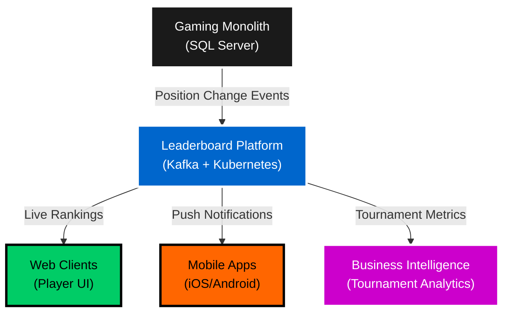
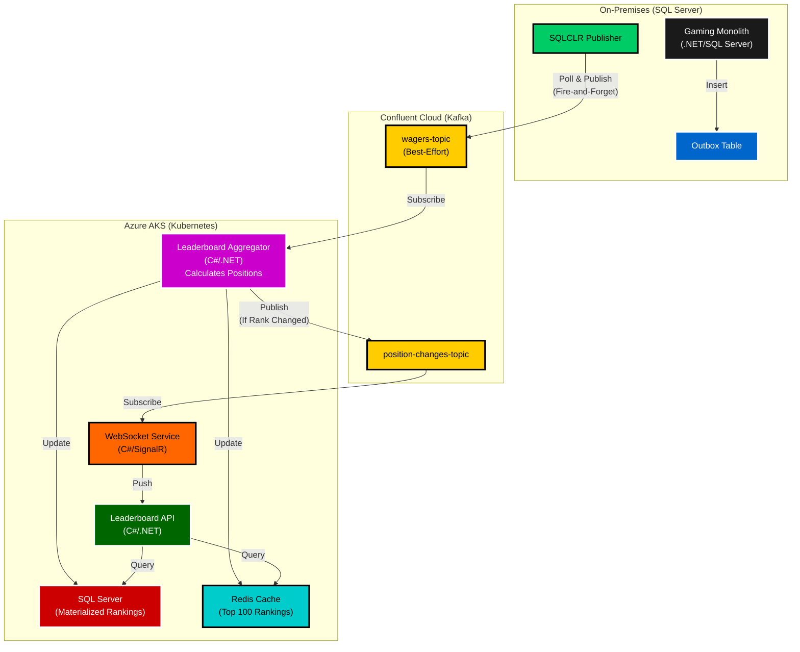
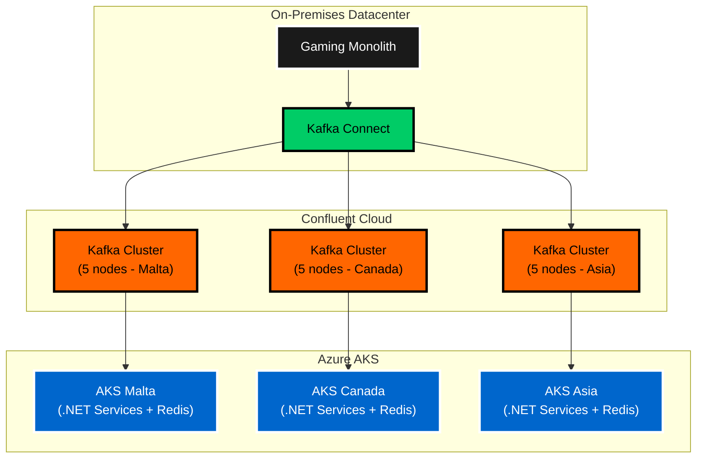

# Real-Time Leaderboard Platform

**Architecture Overview**: Event-driven real-time leaderboard platform processing position change events with 50% latency reduction and 60% cost savings migrating from Azure Durable Functions to Kubernetes.

---

## System Context



---

## Container Architecture



**Legend**: Black: Monolith | Blue: Outbox | Green: Publisher | Yellow: Kafka | Purple: Aggregator | Dark Green: API | Orange: WebSocket | Red: SQL | Cyan: Redis

---

## Key Architecture Decisions

### ADR-001: Migrate from Azure Durable Functions to Kubernetes
**Decision**: Replatform leaderboard processing from Azure Durable Functions to Kubernetes-hosted microservices.

**Context**: Initial implementation used Durable Functions for orchestration, but faced scaling limitations and cold start latency during peak tournament traffic.

**Rationale**:
- **Performance**: Durable Functions had 400-600ms cold start latency during traffic spikes
- **Cost**: Consumption plan costs escalated with 24/7 tournament leaderboards
- **Control**: Needed fine-grained control over resource allocation and scaling policies
- **Portability**: Kubernetes enables multi-cloud strategy (not locked to Azure Functions runtime)

**Consequences**:
- ✅ 50% latency reduction (600ms → 300ms p99 latency)
- ✅ 60% cost savings ($15K/month → $6K/month)
- ✅ Predictable performance (no cold starts with min 2 replicas)
- ✅ Multi-cloud portability (can deploy to AWS/GCP if needed)
- ⚠️ Increased operational complexity (Kubernetes management)
- ⚠️ Team required Kubernetes/Docker upskilling

---

### ADR-002: Best-Effort Wager Events with Position Change Detection
**Decision**: Gaming monolith publishes all wager events as best-effort. Leaderboard system calculates positions and publishes position change events when player rank changes.

**Context**: Need to balance real-time leaderboard updates with system performance. Publishing every wager event is necessary for accurate scoring, but not every wager changes leaderboard positions.

**Rationale**:
- **Separation of Concerns**: Gaming monolith publishes raw wager events (single responsibility)
- **Leaderboard Intelligence**: Leaderboard aggregator calculates positions and determines if rank changed
- **Best-Effort Delivery**: Wager events are fire-and-forget (no acknowledgment needed for gaming transactions)
- **Position Change Events**: Only meaningful rank changes published to WebSocket clients (reduces UI noise)

**Consequences**:
- ✅ Clean separation: Gaming system unaware of leaderboard logic
- ✅ 90% reduction in WebSocket traffic (position changes vs. all wagers)
- ✅ Accurate leaderboard (processes all wagers, but notifies only on rank changes)
- ✅ Best-effort wagers don't block gaming transactions (fire-and-forget)
- ⚠️ Leaderboard aggregator must maintain state to detect position changes

---

### ADR-003: Redis Cache for Top 100 Rankings
**Decision**: Use Redis as a hot cache for top 100 leaderboard rankings with SQL Server as the source of truth.

**Context**: Leaderboard API receives 10K+ requests/second during major tournaments. SQL Server alone cannot sustain this read load.

**Rationale**:
- **Read Performance**: Redis provides <5ms p99 latency vs. 50-100ms for SQL Server
- **Write-Through Pattern**: Aggregator updates both Redis (cache) and SQL Server (persistent)
- **Cache Invalidation**: Redis TTL + manual invalidation on leaderboard reset
- **Cost-Effective**: Single Redis cluster cheaper than scaling SQL Server read replicas

**Consequences**:
- ✅ 95% reduction in SQL Server read load
- ✅ <5ms API response time for top 100 queries
- ✅ Horizontal scaling: Add Redis cluster nodes for larger leaderboards
- ⚠️ Cache consistency: Small window where Redis and SQL may differ (eventual consistency acceptable)
- ⚠️ Redis cluster management overhead

---

### ADR-004: WebSocket (SignalR) for Real-Time Updates
**Decision**: Use SignalR WebSockets to push live leaderboard updates to connected clients.

**Context**: Players expect real-time leaderboard updates during tournaments without manual refresh.

**Rationale**:
- **Push Model**: Server pushes updates to clients (vs. polling which wastes bandwidth)
- **SignalR**: Microsoft's .NET library with fallback to long-polling for older browsers
- **Pub/Sub**: WebSocket service subscribes to `leaderboard-updates-topic` and broadcasts to clients
- **Connection Management**: SignalR handles reconnection, heartbeats, scaling across pods

**Consequences**:
- ✅ Real-time user experience (<500ms update latency)
- ✅ 80% reduction in API request volume (no polling)
- ✅ Better mobile experience (push notifications on rank changes)
- ✅ SignalR scales horizontally with Azure SignalR Service or Redis backplane
- ⚠️ WebSocket connection management overhead (5K connections/pod)

---

## Deployment Architecture

**Multi-Region Deployment**: Malta, Canada, Isle of Man, Europe, Asia, Oceania



**Infrastructure**: 5-node Kafka clusters, Kubernetes auto-scaling (2-10 pods), Redis Cluster mode

---

## Performance Metrics

| Metric | Durable Functions | Kubernetes | Improvement |
|--------|-------------------|------------|-------------|
| **P99 Latency** | 600ms | 300ms | 50% reduction |
| **Cold Start** | 400-600ms | 0ms (min replicas) | 100% elimination |
| **Monthly Cost** | $15,000 | $6,000 | 60% savings |
| **Max Throughput** | 2K events/sec | 10K events/sec | 5x increase |
| **WebSocket Connections** | 5K/instance | 10K/pod | 2x density |

**Availability**: 99.95% (Kubernetes health checks, auto-restart failed pods)

---

## Technical Highlights

### Leaderboard Aggregator (C#/.NET)
```csharp
// Subscribe to best-effort wager events
consumer.Subscribe("wagers-topic");

while (running) {
    var message = consumer.Consume();
    var wager = JsonSerializer.Deserialize<Wager>(message.Value);
    
    // Calculate new score and position
    var newScore = await CalculateScore(wager.TournamentId, wager.PlayerId, wager.Amount);
    var oldRank = await redis.ZRevRankAsync($"leaderboard:{wager.TournamentId}", wager.PlayerId);
    
    // Update Redis cache (sorted set automatically re-sorts)
    await redis.ZAddAsync($"leaderboard:{wager.TournamentId}", newScore, wager.PlayerId);
    var newRank = await redis.ZRevRankAsync($"leaderboard:{wager.TournamentId}", wager.PlayerId);
    
    // Update SQL Server (full rankings)
    await sql.UpsertRankingAsync(wager.TournamentId, wager.PlayerId, newScore, newRank);
    
    // Publish position change event ONLY if rank changed
    if (oldRank != newRank) {
        await producer.ProduceAsync("position-changes-topic", new PositionChange {
            TournamentId = wager.TournamentId,
            PlayerId = wager.PlayerId,
            OldRank = oldRank,
            NewRank = newRank,
            Score = newScore
        });
    }
}
```

### Redis Top 100 Query
```csharp
// Get top 100 players with scores (O(log N) sorted set query)
var top100 = await redis.ZRevRangeByScoreWithScoresAsync(
    $"leaderboard:{tournamentId}", 0, 99);

return top100.Select((player, index) => new LeaderboardEntry {
    Rank = index + 1,
    PlayerId = player.Element,
    Score = player.Score
});
```

### SignalR Real-Time Push
```csharp
// WebSocket service broadcasts to connected clients
public class LeaderboardHub : Hub {
    public async Task SubscribeToTournament(string tournamentId) {
        await Groups.AddToGroupAsync(Context.ConnectionId, tournamentId);
    }
}

// Kafka consumer subscribes to position change events (not all wagers)
consumer.Subscribe("position-changes-topic");
await hubContext.Clients.Group(tournamentId)
    .SendAsync("LeaderboardUpdate", positionChange);
```

---

## Evolution Story: Durable Functions → Kubernetes

**Phase 1 (2022)**: Azure Durable Functions
- Orchestrated leaderboard updates using Durable Entities (actor model)
- Simple deployment (no Kubernetes knowledge required)
- **Pain Points**: Cold starts, consumption plan costs, scaling limits

**Phase 2 (2023)**: Migration to Kubernetes
- Containerized .NET services (Docker)
- Deployed to Azure AKS with Horizontal Pod Autoscaler (HPA)
- Redis cache introduced for read scalability
- **Results**: 50% latency reduction, 60% cost savings

**Phase 3 (2024)**: Multi-Region Kafka
- Migrated to Confluent Cloud for managed Kafka
- 5-node clusters per region for high availability
- **Results**: 99.95% availability, auto-scaling for tournaments

---

## Security & Compliance

- **Authentication**: Azure AD B2C for player authentication
- **Authorization**: JWT tokens with claims-based access control
- **Rate Limiting**: API Gateway throttling (100 requests/min per player)
- **DDoS Protection**: Azure Front Door with WAF rules
- **Data Privacy**: GDPR-compliant player data handling (right to erasure)
- **Audit Logging**: All leaderboard updates logged to immutable Data Warehouse

---

## Business Impact

**Player Engagement**:
- 40% increase in tournament participation (real-time rankings drive competition)
- 25% increase in session duration during tournaments
- 15% increase in wager volume (players chase leaderboard positions)

**Operational Efficiency**:
- 60% cost reduction ($108K/year savings)
- 50% latency reduction (better user experience)
- 99.95% availability (reduced support tickets for "leaderboard not updating")

---

## Future Roadmap

1. **Predictive Leaderboards**: ML models predict final tournament rankings (Azure ML + Kafka Streams)
2. **Social Features**: Friend leaderboards, clan rankings (Redis Sorted Sets)
3. **Gamification**: Achievements, badges for leaderboard milestones
4. **Multi-Game Leaderboards**: Cross-game tournaments (e.g., slots + poker combined rankings)

---

**Prepared by**: [Your Name]  
**Date**: November 2025  
**Interview**: Booking.com - Fintech Architect Role