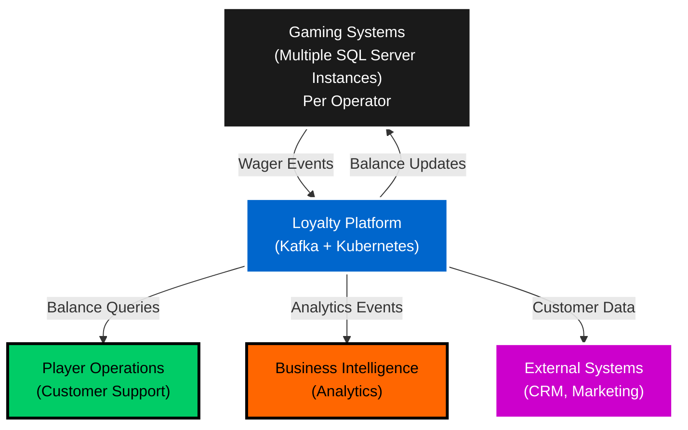
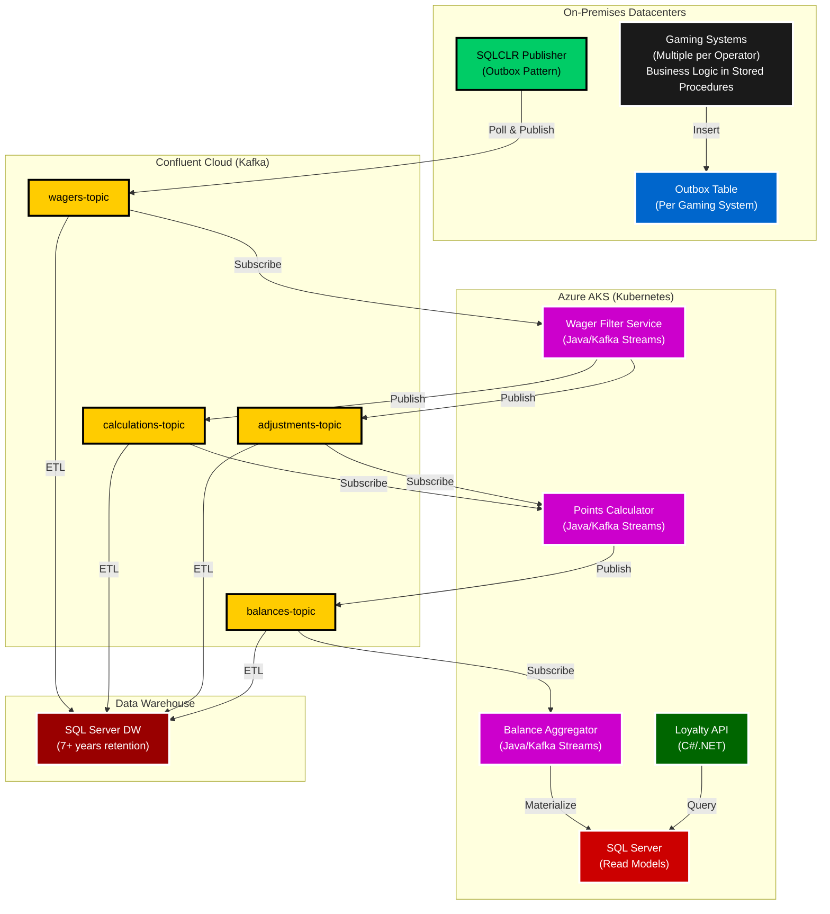
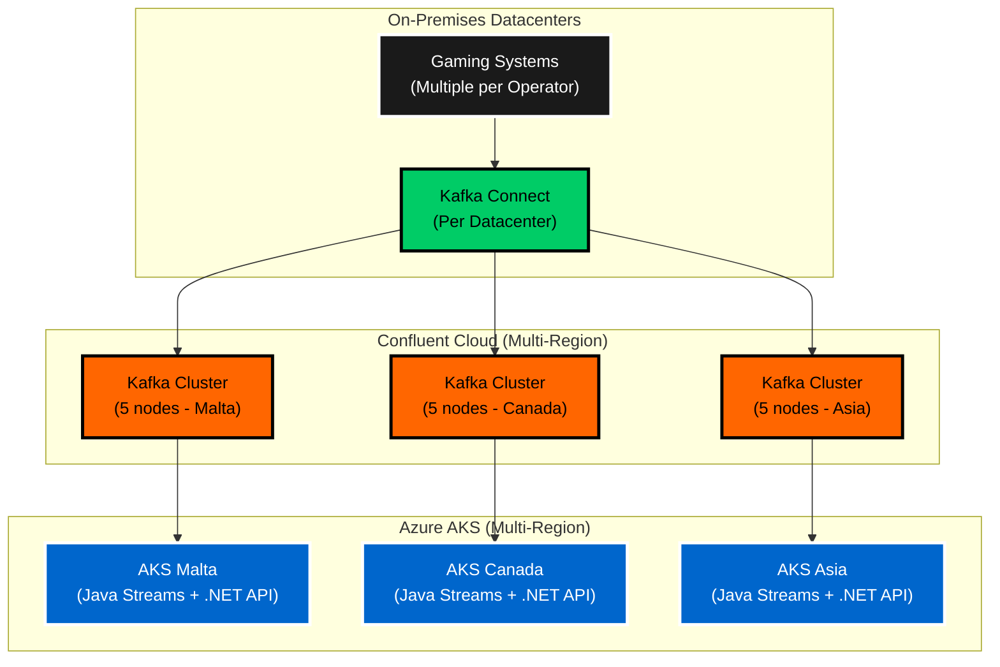

# Loyalty Points Extraction Platform

**Architecture Overview**: Hybrid cloud event-driven platform migrating loyalty points processing from monolithic SQL Server to Kafka-based streaming architecture with 30% latency reduction and 50B events/month throughput.

---

## System Context



---

## Container Architecture



**Legend**: Black: Gaming Systems (multiple per operator) | Blue: Outbox | Green: Publisher | Yellow: Kafka Topics | Purple: Streams | Dark Green: API | Red: SQL | Dark Red: DW

**Architecture Note**: Multiple gaming systems (often several per operator) each run on dedicated SQL Server instances with business logic implemented in stored procedures (legacy architecture).

---

## Key Architecture Decisions

### ADR-001: Java Kafka Streams for Stream Processing
**Decision**: Use Java and Kafka Streams for real-time event processing despite being a .NET organization.

**Context**: Derivco is a .NET/C# shop with SQL Server as the standard persistence layer. Introducing Java was a significant strategic departure.

**Rationale**:
- Kafka Streams is the native, battle-tested framework for Kafka-based stream processing
- Provides stateful processing with exactly-once semantics out of the box
- Extensive community support and production-proven patterns
- Trade-off: Team needed Java upskilling, but gained industry-standard streaming capabilities

**Consequences**:
- ✅ 30% reduction in wager-to-balance latency (sub-second processing)
- ✅ 50B events/month throughput with automatic scaling
- ✅ Exactly-once processing guarantees for financial accuracy
- ⚠️ Introduced technology diversity (Java + .NET ecosystem)
- ⚠️ Team required Java/Kafka Streams training

---

### ADR-002: SQLCLR Outbox Pattern for Event Publishing
**Decision**: Use SQL Server SQLCLR stored procedures to implement outbox pattern for reliable event publishing across multiple gaming systems.

**Context**: Multiple gaming systems per operator (each on dedicated SQL Server instances) required transactional consistency between database changes and event publishing. Legacy architecture had business logic in stored procedures.

**Rationale**:
- SQLCLR provides transactional guarantees (insert + publish are atomic)
- Outbox table acts as durable buffer for events during Kafka outages
- Leverages existing SQL Server expertise and infrastructure
- No external change data capture (CDC) tools required

**Consequences**:
- ✅ Zero data loss during Kafka cluster maintenance/failures
- ✅ Transactional consistency between gaming state and loyalty events
- ✅ Leveraged team's SQL Server expertise (business logic already in stored procedures)
- ✅ Deployed across multiple gaming systems with consistent pattern
- ⚠️ SQLCLR performance overhead (acceptable for loyalty event volume)
- ⚠️ Coordination across multiple gaming systems (each has own outbox)

---

### ADR-003: Hybrid Cloud Architecture
**Decision**: Migrate from on-premises Kafka to Confluent Cloud while keeping gaming systems on-premises.

**Context**: Need cloud scalability and managed Kafka operations without migrating legacy gaming systems (multiple per operator, stored procedure-heavy business logic).

**Rationale**:
- Strangler fig pattern: Extract loyalty to cloud while gaming systems remain on-prem
- Confluent Cloud provides managed Kafka with 99.99% SLA
- Kafka Connect bridges on-prem to cloud securely
- Gaming systems migration too risky/expensive (multiple systems, stored procedure business logic, per-operator customizations)

**Consequences**:
- ✅ 60% reduction in Kafka operational overhead
- ✅ Auto-scaling for seasonal traffic spikes (Christmas, major tournaments)
- ✅ Business continuity: Gaming systems unchanged (no risk to revenue)
- ✅ Scalable to multiple gaming systems per operator
- ⚠️ Network latency between on-prem and cloud (~10-20ms acceptable)
- ⚠️ Data governance across hybrid infrastructure
- ⚠️ Coordination of Kafka Connect per datacenter

---

### ADR-004: Data Retention Strategy
**Decision**: 7-day Kafka retention, 7+ years in SQL Server and Data Warehouse.

**Context**: Fintech/gaming regulatory requirements mandate long-term audit trails and dispute resolution capabilities.

**Rationale**:
- **Kafka (7 days)**: Optimized for stream processing, not long-term storage
- **SQL Server (7+ years)**: Operational read models for real-time balance queries
- **Data Warehouse (7+ years)**: Compliance, analytics, ML, regulatory reporting
- Separates streaming (Kafka), operational (SQL), and analytical (DW) concerns

**Consequences**:
- ✅ Compliance with gaming/fintech regulations
- ✅ Kafka cluster cost optimization (no long-term storage bloat)
- ✅ Fast dispute resolution (historical balance snapshots in DW)
- ✅ Analytics/ML on complete player behavior history
- ⚠️ ETL pipeline from Kafka to DW required (batch nightly)

---

## Deployment Architecture

**Multi-Region Deployment**: Malta, Canada, Isle of Man, Europe, Asia, Oceania



**Infrastructure**: 5-node Kafka clusters per region, Kubernetes auto-scaling (2-20 pods per service), Kafka Connect per datacenter aggregates events from multiple gaming systems

---

## Business Impact

| Metric | Before | After | Improvement |
|--------|--------|-------|-------------|
| **Wager-to-Balance Latency** | 3-5 seconds | <1 second | 70-80% reduction |
| **Throughput** | 30B events/month | 50B events/month | 67% increase |
| **Kafka Ops Overhead** | 2 FTE | 0.8 FTE | 60% reduction |
| **System Availability** | 99.5% | 99.95% | 0.45pp improvement |
| **Dispute Resolution Time** | 2-4 hours | 15 minutes | 88% reduction |

**Cost Savings**: $180K/year (Confluent Cloud managed services vs. on-prem Kafka operations)

---

## Technical Highlights

### Stream Processing (Java/Kafka Streams)
```java
// Wager Filter Service - Filter eligible wagers
StreamsBuilder builder = new StreamsBuilder();
KStream<String, Wager> wagers = builder.stream("wagers-topic");

wagers
    .filter((key, wager) -> wager.isLoyaltyEligible())
    .to("calculations-topic");
```

### SQLCLR Outbox Pattern
```sql
-- Transactional event publishing (deployed across multiple gaming systems)
CREATE PROCEDURE PublishWagerEvent
    @PlayerId INT,
    @WagerAmount DECIMAL(18,2),
    @GamingSystemId VARCHAR(50)  -- Identifies which gaming system
AS
BEGIN TRANSACTION
    -- 1. Insert gaming transaction (business logic in stored procedure - legacy pattern)
    INSERT INTO Transactions (PlayerId, Amount, GamingSystemId) 
    VALUES (@PlayerId, @WagerAmount, @GamingSystemId)
    
    -- 2. Insert to outbox (SQLCLR polls this table)
    INSERT INTO OutboxEvents (EventType, Payload, GamingSystemId) 
    VALUES ('WagerPlaced', JSON_OBJECT(@PlayerId, @WagerAmount, @GamingSystemId), @GamingSystemId)
COMMIT TRANSACTION

-- Note: Each gaming system (often multiple per operator) has its own outbox table
-- SQLCLR publisher deployed to each SQL Server instance
```

### Exactly-Once Semantics
- Kafka idempotent producers (deduplicate retries)
- Transactional writes to Kafka state stores
- SQL Server upserts with unique constraints (player balance per game)

---

## Security & Compliance

- **PCI-DSS**: No credit card data in loyalty platform (references only)
- **GDPR**: Player data encryption at rest (AES-256) and in transit (TLS 1.3)
- **Audit Trail**: All balance changes logged to immutable append-only Data Warehouse
- **Access Control**: Azure AD integration, RBAC on Kubernetes, Kafka ACLs
- **Data Residency**: Regional clusters ensure data stays in regulatory jurisdiction

---

## Future Roadmap

1. **Machine Learning Integration**: Real-time fraud detection on wager patterns (Kafka Streams → Azure ML)
2. **GraphQL API**: Replace REST with GraphQL for flexible client queries
3. **Event Sourcing**: Migrate SQL Server read models to full event sourcing (rebuild state from Kafka)
4. **Multi-Currency Support**: Extend points calculation for crypto rewards (Bitcoin, Ethereum)

---

**Prepared by**: [Your Name]  
**Date**: November 2025  
**Interview**: Booking.com - Fintech Architect Role