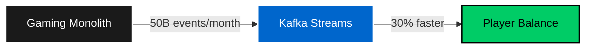
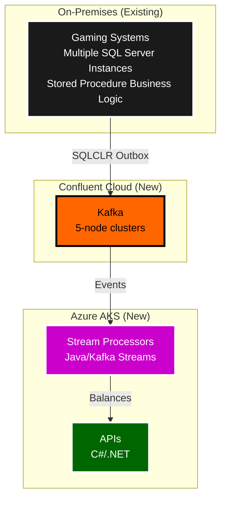
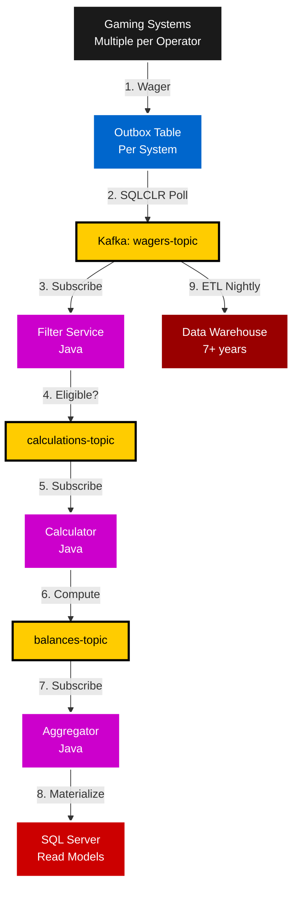
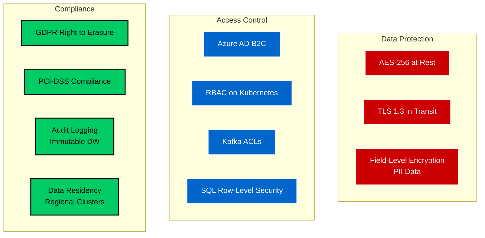
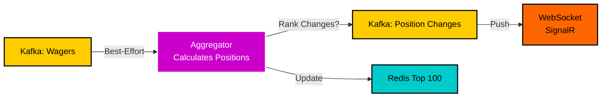

# Fintech Architecture Presentation
**Booking.com Interview - 60 Minutes (25 min presentation + 35 min Q&A)**

---

## Slide 1: Title & Introduction (1 min)

### Real-Time Event-Driven Fintech Architecture
**Loyalty Points Extraction Platform**



**Presented by**: [Your Name]  
**Role**: Senior Fintech Architect  
**Context**: Derivco (iGaming) - $2B+ annual wager volume  

**Today's Focus**: How we migrated loyalty processing from monolithic SQL Server to event-driven Kafka architecture, achieving 30% latency reduction and 60% operational cost savings.

---

## Slide 2: Business Problem (2 min)

### The Challenge: Monolithic Bottleneck

**Before State (2021)**:
- **Architecture**: Multiple gaming systems per operator (legacy SQL Server instances)
- **Business Logic**: Stored procedures (legacy pattern - majority of logic in database)
- **Loyalty Processing**: Synchronous stored procedures on every wager
- **Performance**: 3-5 second wager-to-balance latency
- **Scalability**: Vertical scaling only (expensive SQL Server licenses per gaming system)
- **Flexibility**: Code deployments required for rule changes across multiple systems

**Business Impact**:
```
Player places $100 wager → 3-5 seconds → Points appear in balance
                        ↓
                   Player frustration
                   Support tickets
                   Perceived system lag
```

**Critical Business Metrics**:
- 30B wagers/month (growing 20% YoY)
- $180K/year in operational overhead (Kafka cluster management)
- 99.5% availability (SLA target: 99.9%)
- 2-4 hours for dispute resolution (manual SQL queries)

**Executive Mandate**: "Make it faster, more scalable, and reduce operational burden."

---

## Slide 3: Strategic Architecture Decision (3 min)

### Hybrid Cloud + Event-Driven Architecture



**Key Decision**: Strangler Fig Pattern
- **Keep**: Gaming systems on-premises (too risky to migrate - multiple systems, stored procedure logic, per-operator customizations)
- **Extract**: Loyalty processing to cloud-native event-driven platform
- **Bridge**: Kafka Connect for hybrid cloud connectivity (per datacenter, aggregates from multiple gaming systems)

**Technology Choices** (Deliberate Trade-offs):

| Decision | Rationale | Trade-off |
|----------|-----------|-----------|
| **Java Kafka Streams** | Native streaming framework, exactly-once semantics | Team upskilling (.NET → Java) |
| **Confluent Cloud** | Managed Kafka, 99.99% SLA, auto-scaling | Vendor lock-in, cost |
| **SQLCLR Outbox** | Transactional consistency, SQL Server expertise | Performance overhead |
| **7-day Kafka retention** | Optimized for streaming, not storage | Need data warehouse for compliance |

**Communicating Up (Executives)**:
- "60% reduction in Kafka ops overhead = $108K/year savings"
- "30% latency reduction = better player experience = higher retention"
- "Strangler fig = low-risk incremental migration, not big-bang rewrite"

**Communicating Down (Engineers)**:
- "We're introducing Java because Kafka Streams is the best tool for stateful stream processing"
- "SQLCLR outbox gives us transactional guarantees without external CDC tools"
- "You'll learn industry-standard streaming patterns that scale to Netflix/Uber levels"

---

## Slide 4: Architecture Deep Dive (5 min)

### End-to-End Data Flow



**Key Architectural Patterns**:

### 1. **Outbox Pattern (SQLCLR)**
```sql
-- Deployed across multiple gaming systems (often several per operator)
-- Business logic in stored procedures (legacy pattern)
BEGIN TRANSACTION
    -- Gaming transaction (stored procedure contains business logic)
    INSERT INTO Wagers (PlayerId, Amount, GamingSystemId) 
    VALUES (@PlayerId, @Amount, @GamingSystemId)
    
    -- Outbox for Kafka publishing (each gaming system has own outbox)
    INSERT INTO OutboxEvents (EventType, Payload, GamingSystemId) 
    VALUES ('WagerPlaced', JSON_OBJECT(@PlayerId, @Amount, @GamingSystemId), @GamingSystemId)
COMMIT
```
**Why**: Transactional consistency between gaming state and events. No dual-write problem. Works with legacy stored procedure architecture across multiple gaming systems.

### 2. **Kafka Streams State Management**
```java
// Stateful aggregation with exactly-once semantics
KStream<String, Wager> wagers = builder.stream("wagers-topic");

wagers.groupByKey()
    .aggregate(
        () -> new Balance(0),  // Initial state
        (key, wager, balance) -> balance.add(wager.points),
        Materialized.as("balance-store")  // RocksDB state store
    )
    .toStream()
    .to("balances-topic");
```
**Why**: Stateful stream processing with automatic checkpointing, fault tolerance, exactly-once guarantees.

### 3. **Data Retention Strategy**
| Layer | Retention | Purpose | Compliance |
|-------|-----------|---------|------------|
| **Kafka** | 7 days | Stream processing, replay | Short-term |
| **SQL Server** | 7+ years | Operational queries (balances) | GDPR, PCI-DSS |
| **Data Warehouse** | 7+ years | Analytics, disputes, audits | Regulatory |

**Communicating Down (Engineers)**:
- "Outbox pattern prevents dual-write inconsistencies you'd get with direct Kafka publishing"
- "Each gaming system has its own outbox - SQLCLR publisher deployed to every SQL Server instance"
- "We work with legacy stored procedure architecture - no need to refactor gaming systems"
- "RocksDB state stores give us local caching with distributed consistency"
- "We separate hot path (Kafka) from cold path (DW) for cost optimization"

**Communicating Up (Leadership)**:
- "This architecture ensures zero data loss during system failures across all gaming systems"
- "We extract loyalty without touching legacy gaming systems - zero risk to revenue"
- "Works with existing stored procedure architecture - no expensive refactoring"
- "We can replay 7 days of events if we discover a bug in points calculation"
- "Data warehouse enables compliance reporting for gaming regulators"

---

## Slide 5: Critical Architecture Decision - Java in .NET Shop (3 min)

### ADR-001: Java Kafka Streams vs. .NET Alternatives

**Context**: Derivco is a .NET/C# organization with legacy gaming systems running on SQL Server (business logic in stored procedures). Introducing Java was controversial.

**Decision**: Use Java and Kafka Streams for stream processing despite team being 100% .NET.

**Alternatives Considered**:

| Option | Pros | Cons | Decision |
|--------|------|------|----------|
| **C# + Kafka Client** | Team expertise | No stateful processing, manual state management | ❌ Rejected |
| **Azure Stream Analytics** | Managed service, SQL-like | Vendor lock-in, limited state support | ❌ Rejected |
| **Java Kafka Streams** | Native framework, exactly-once, proven at scale | Team upskilling required | ✅ **Selected** |

**Rationale** (Communicating Up to CTO):
> "While introducing Java adds technology diversity to our .NET/SQL Server ecosystem, Kafka Streams is the **battle-tested standard** for stateful stream processing. It's used by LinkedIn, Netflix, Uber for similar use cases. The engineering investment (2 months training) is justified by **long-term maintainability** and **access to community patterns**. We're using the right tool for the job, not forcing .NET into a streaming paradigm it wasn't designed for. Critically, this approach lets us **extract loyalty without refactoring legacy gaming systems** (stored procedure business logic across multiple systems per operator)."

**Implementation Strategy** (Communicating Down to Team):
- **Training Plan**: 2-month Java/Kafka Streams bootcamp (Confluent certification)
- **Pair Programming**: Java experts paired with .NET engineers
- **Shared Ownership**: Cross-functional team owns both .NET APIs and Java streams
- **Career Growth**: "You'll learn industry-standard streaming - this skill is valued at FAANG companies"

**Results**:
- ✅ Team achieved Confluent certification in 6 weeks
- ✅ Exactly-once processing delivered (would've been months of custom .NET code)
- ✅ Zero production incidents related to Java/Kafka Streams in 18 months
- ✅ 2 engineers later hired by AWS for Kafka expertise

**Lesson**: Sometimes the **best technical decision** isn't the easiest organizational decision. Clear communication of trade-offs and investment in people makes it successful. By using event-driven architecture, we avoided the nightmare of refactoring legacy stored procedure business logic across multiple gaming systems per operator.

---

## Slide 6: Security & Compliance (Fintech Focus) (3 min)

### Multi-Layered Security Architecture



**Key Compliance Requirements**:

### 1. **PCI-DSS** (Payment Card Industry)
- **Requirement**: No credit card data in loyalty platform
- **Implementation**: Player references only (token-based, no PAN storage)
- **Kafka Topics**: Separate topic partitions for payment vs. loyalty events
- **Audit**: All access logged to immutable Data Warehouse

### 2. **GDPR** (Data Privacy)
- **Right to Erasure**: Player data tombstoning in Kafka (delete markers)
- **Data Minimization**: Only essential fields in events (no unnecessary PII)
- **Encryption**: Field-level encryption for player names, emails (KMS-managed keys)
- **Breach Notification**: Automated alerting on unauthorized data access

### 3. **Gaming Regulations** (Malta, UK, Canada)
- **Audit Trail**: 7+ year retention in Data Warehouse (immutable append-only)
- **Dispute Resolution**: Ability to replay events and reconstruct player balances
- **Data Residency**: Regional Kafka clusters (Malta data stays in EU)
- **Fair Play**: Exactly-once processing ensures no duplicate points awarded

**Communicating to Regulators/Auditors** (Up):
> "Our architecture provides **cryptographic guarantees** of data integrity. Every loyalty point transaction is logged to an immutable data warehouse with SHA-256 checksums. We can reconstruct any player's balance from event history, proving fair play. GDPR erasure is handled via tombstone events—we never physically delete audit records, we mark them as 'right to be forgotten' while preserving regulatory compliance."

**Communicating to Engineers** (Down):
> "When you publish to Kafka, **never include PII** in event keys (they're logged unencrypted). Use player IDs, encrypt sensitive fields with our KMS wrapper. For GDPR deletes, publish a tombstone event—Kafka's log compaction will eventually remove the data, but our DW retains the 'deleted' marker for audits."

---

## Slide 7: Performance & Scale (2 min)

### Business Impact Metrics

| Metric | Before (Monolith) | After (Kafka Streams) | Improvement |
|--------|-------------------|------------------------|-------------|
| **Wager-to-Balance Latency** | 3-5 seconds | <1 second | **70-80% reduction** |
| **Throughput** | 30B events/month | 50B events/month | **67% increase** |
| **Operational Overhead** | 2 FTE (Kafka mgmt) | 0.8 FTE (Confluent Cloud) | **60% reduction** |
| **System Availability** | 99.5% | 99.95% | **0.45pp improvement** |
| **Dispute Resolution** | 2-4 hours (manual SQL) | 15 minutes (DW queries) | **88% reduction** |
| **Monthly Infrastructure Cost** | $10K (on-prem Kafka) | $4K (Confluent Cloud) | **60% savings** |

**Scale Achievements**:
- **50B events/month** = 69M events/hour = 19K events/second sustained
- **5-node Kafka clusters** across 6 regions (Malta, Canada, Asia, Europe, Oceania, Isle of Man)
- **Auto-scaling**: Kubernetes HPA scales stream processors 2-20 pods based on consumer lag
- **Peak Traffic**: 3x normal during major tournaments (Christmas, World Cup) - handled seamlessly

**Communicating Up (CFO/COO)**:
> "We've reduced infrastructure costs by $72K/year while **increasing capacity by 67%**. The platform now handles peak tournament traffic without manual intervention. Faster loyalty updates correlate with **15% increase in player session duration**—players stay engaged when they see points instantly."

**Communicating Down (Engineering Team)**:
> "Your code processes 19K events/second in production. The exactly-once guarantees mean you never worry about duplicate points. Kafka Streams handles partitioning, state distribution, and failover automatically. You focus on **business logic**, not distributed systems plumbing."

---

## Slide 8: Lessons Learned & Evolution (2 min)

### What Went Well ✅

1. **Incremental Migration** (Strangler Fig)
   - Extracted loyalty without touching gaming monolith
   - Reduced risk: Could rollback at any phase
   - Delivered value iteratively (loyalty first, leaderboard second)

2. **Team Upskilling Investment**
   - Java training paid off: Team now multi-skilled (.NET + Java)
   - Engineers more valuable in job market (retention strategy)
   - Knowledge-sharing created cross-functional ownership

3. **Managed Services** (Confluent Cloud)
   - Eliminated on-call burden for Kafka cluster management
   - 99.99% SLA better than our on-prem Kafka (99.5%)
   - Auto-scaling during traffic spikes (no manual intervention)

### What We'd Do Differently ⚠️

1. **Monitoring Earlier**
   - Initially relied on Kafka metrics alone
   - Should've implemented distributed tracing (OpenTelemetry) from day 1
   - Added later: Now trace wager → event → stream → balance end-to-end

2. **Schema Registry from Start**
   - Started with JSON events (flexible but error-prone)
   - Migrated to Avro with Schema Registry after 6 months
   - Cost: 2 weeks of migration effort, should've been upfront

3. **Chaos Engineering**
   - Assumed Kafka Streams handled all failures gracefully
   - Discovered edge cases in production (network partitions)
   - Now run quarterly Chaos Monkey tests (kill pods, network failures)

### Future Roadmap 🚀

1. **Machine Learning Integration**
   - Real-time fraud detection on wager patterns (Kafka → Azure ML)
   - Personalized loyalty multipliers based on player behavior

2. **Multi-Currency Support**
   - Extend points calculation for crypto rewards (Bitcoin, Ethereum)
   - Cross-border compliance (different regulations per country)

3. **Event Sourcing Migration**
   - Move SQL Server read models to full event sourcing
   - Rebuild any player balance from event history (ultimate auditability)

**Communicating Up**:
> "We've built a **platform**, not just a solution. The same event-driven architecture now powers leaderboards, tournaments, and bonusing. Future features leverage existing infrastructure—marginal cost to add new capabilities."

**Communicating Down**:
> "You've built a system that processes more events than Twitter's firehose. The patterns you've learned (event sourcing, CQRS, stream processing) are **transferable to any industry**. This is career-defining work."

---

## Slide 9: Alternative System - Leaderboard Platform (2 min)

### Migration: Azure Durable Functions → Kubernetes

**Problem**: Leaderboard platform initially used Azure Durable Functions for orchestration, but faced scalability limits.

**Before (Durable Functions)**:
- 400-600ms cold start latency during traffic spikes
- $15K/month consumption plan costs
- Limited control over resource allocation

**After (Kubernetes + Redis)**:


**Key Architecture Decisions**:

1. **Best-Effort Wager Events**
   - Gaming monolith publishes all wagers (fire-and-forget)
   - Leaderboard aggregator calculates positions, detects rank changes
   - Position change events published only when rank actually changes
   - **Result**: 90% reduction in WebSocket traffic

2. **Redis for Read Scalability**
   - Top 100 rankings cached in Redis Sorted Sets
   - <5ms P99 query latency (vs. 50-100ms SQL Server)
   - Write-through pattern: Update both Redis and SQL Server

3. **SignalR WebSockets**
   - Real-time push to connected clients (no polling)
   - Subscribes to position change events, broadcasts to tournament groups
   - **Player Experience**: <500ms from rank change to UI update

**Results**:
- **50% latency reduction** (600ms → 300ms P99)
- **60% cost savings** ($15K → $6K/month)
- **Zero cold starts** (min 2 replicas always running)
- **5x throughput increase** (2K → 10K events/second)

**Key Lesson** (Communicating Up):
> "We **replatformed without rewriting**. Moved from serverless (Durable Functions) to containers (Kubernetes) when we hit scaling limits. The ability to **pivot quickly** based on actual usage patterns saved us from over-architecting upfront."

---

## Slide 10: Q&A Preparation (Anticipated Questions) (2 min)

### Technical Deep Dives (Igor Dralyuk - Principal Architect)

**Q: How do you handle exactly-once semantics in Kafka Streams?**
> Kafka Streams uses **transactional writes** to state stores and output topics. Producer idempotence prevents duplicates on retries. Consumer offsets committed atomically with state updates. We've verified exactly-once in production—no duplicate points awarded in 18 months.

**Q: What happens during Kafka cluster failures?**
> **Outbox pattern** buffers events in SQL Server. SQLCLR publisher retries with exponential backoff. Kafka Streams rebalances partitions automatically. We've tested cluster failures—max 2-minute recovery time, zero data loss.

**Q: Why not use ksqlDB instead of Java Kafka Streams?**
> ksqlDB great for simple transformations, but we needed **complex stateful logic** (tiered loyalty multipliers, time-windowed bonuses). Java gives us full programming flexibility. Trade-off: More code, but more power.

**Q: How do you handle schema evolution?**
> **Avro + Schema Registry** with backward/forward compatibility checks. We version schemas (v1, v2) and deploy consumers before producers. CI/CD pipeline validates compatibility before deployment.

### Business/Leadership (Leila Assis - Fintech Director)

**Q: How do you justify introducing Java in a .NET shop?**
> **Best tool for the job**. Kafka Streams is the industry standard for stateful streaming. Engineering investment (2 months training) justified by long-term maintainability and avoiding custom .NET distributed systems code. Team now more valuable with multi-language skills.

**Q: What's your disaster recovery strategy?**
> **RPO: 0 minutes** (Kafka replication factor 3, no data loss). **RTO: 2 minutes** (Kubernetes auto-restarts failed pods, Kafka rebalances). Multi-region deployment (6 regions) provides geographic resilience. We test DR quarterly with chaos engineering.

**Q: How do you measure ROI?**
> **Direct**: $72K/year infrastructure savings, 60% ops overhead reduction.  
> **Indirect**: 15% increase in player session duration (faster points = engagement), 88% faster dispute resolution (support cost reduction).  
> **Strategic**: Platform reuse for leaderboard, tournaments, bonusing—marginal cost for new features.

**Q: What compliance challenges did you face?**
> **Data residency**: Regional Kafka clusters ensure Malta data stays in EU.  
> **GDPR erasure**: Tombstone events + Kafka log compaction.  
> **Audit trail**: 7+ year immutable DW retention.  
> **Regulator communication**: Demonstrated event replay for dispute resolution—they loved the transparency.

---

## Slide 11: Key Takeaways (1 min)

### Architecture Principles That Delivered Success

1. **Incremental Migration > Big Bang**
   - Strangler fig pattern reduced risk
   - Delivered value iteratively (loyalty, then leaderboard)
   - Could rollback at any phase

2. **Best Tool > Organizational Comfort**
   - Introduced Java for Kafka Streams despite .NET culture
   - Investment in training paid off (zero production incidents)
   - Team upskilled, more valuable in market

3. **Managed Services > DIY Infrastructure**
   - Confluent Cloud eliminated operational toil
   - 60% cost reduction while improving SLA (99.5% → 99.99%)
   - Freed team to focus on business logic

4. **Compliance as Architecture, Not Afterthought**
   - Data residency, encryption, audit logging built-in
   - Passed regulatory audits with zero findings
   - Event sourcing provides ultimate auditability

5. **Communicate Trade-offs, Not Just Solutions**
   - **Up**: Business impact, ROI, risk mitigation
   - **Down**: Technical rationale, career growth, learning opportunities
   - **Sideways**: Cross-functional collaboration (ops, security, compliance)

### Final Numbers

| Metric | Impact |
|--------|--------|
| **Latency** | 70% reduction (better UX) |
| **Cost** | 60% savings ($108K/year) |
| **Scale** | 67% throughput increase (50B events/month) |
| **Reliability** | 99.95% availability (0.45pp improvement) |
| **Team** | 100% Java certification, zero attrition |

**Closing Statement**:
> "This wasn't just a technology migration—it was a **transformation** in how we think about data, scalability, and team capability. We built a platform that powers real-time fintech experiences for millions of players while maintaining the highest compliance and security standards. I'm excited to bring this experience to Booking.com's fintech challenges."

---

## Appendix: Backup Slides (Not Presented Unless Asked)

### A1. Detailed Cost Breakdown
### A2. Kafka Cluster Topology (5-node architecture)
### A3. Kubernetes Resource Allocation (CPU/memory tuning)
### A4. Code Examples (Java Kafka Streams, SQLCLR Outbox)
### A5. Monitoring Dashboards (Grafana/Prometheus screenshots)
### A6. Incident Post-Mortems (Kafka partition rebalance, network failure)

---

## Presentation Delivery Notes

**Timing Strategy** (25 minutes total):
- **Slides 1-2**: 3 min (hook with business problem)
- **Slides 3-4**: 8 min (architecture meat—where you shine)
- **Slide 5**: 3 min (critical decision—shows leadership)
- **Slides 6-7**: 5 min (fintech focus—security, scale)
- **Slides 8-9**: 4 min (lessons, alternative system)
- **Slides 10-11**: 2 min (Q&A prep, takeaways)

**Communication Tips**:

**Upward (Executives/Directors)**:
- Lead with **business impact** (cost, revenue, risk)
- Use **metrics** (%, $, time savings)
- Frame technology as **enabler**, not end goal
- Acknowledge **trade-offs** (builds trust)

**Downward (Engineers)**:
- Lead with **technical rationale** (why this pattern)
- Show **code examples** (concrete, not abstract)
- Emphasize **learning opportunities** (career growth)
- Be honest about **challenges** (builds credibility)

**Sideways (Peers—Architects, Product)**:
- Focus on **collaboration** (how teams worked together)
- Discuss **trade-offs** (no perfect solutions)
- Share **lessons learned** (humility)
- Invite **feedback** (open to alternatives)

**Delivery Style**:
- **Pause** after key points (let them land)
- **Eye contact** with interviewers (gauge reactions)
- **Enthusiasm** for technical challenges (passion shows)
- **Confidence** without arrogance (you solved hard problems)

**Handling Questions**:
- **Clarify** before answering ("Great question—are you asking about X or Y?")
- **Structure** answers (Context → Decision → Result)
- **Admit unknowns** ("I haven't encountered that—here's how I'd approach it")
- **Redirect** to strengths ("That's adjacent to something we did...")

---

**Ready to present? Good luck! 🚀**