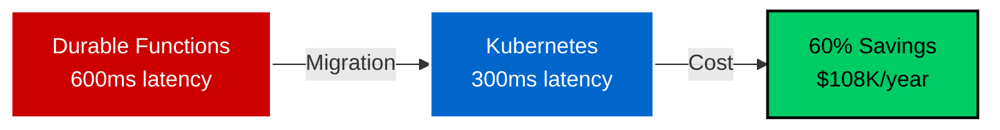
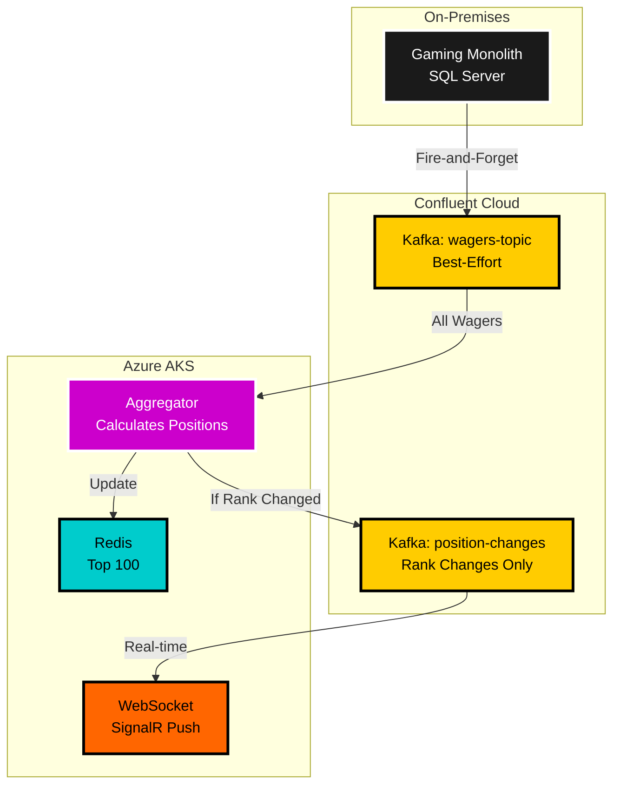
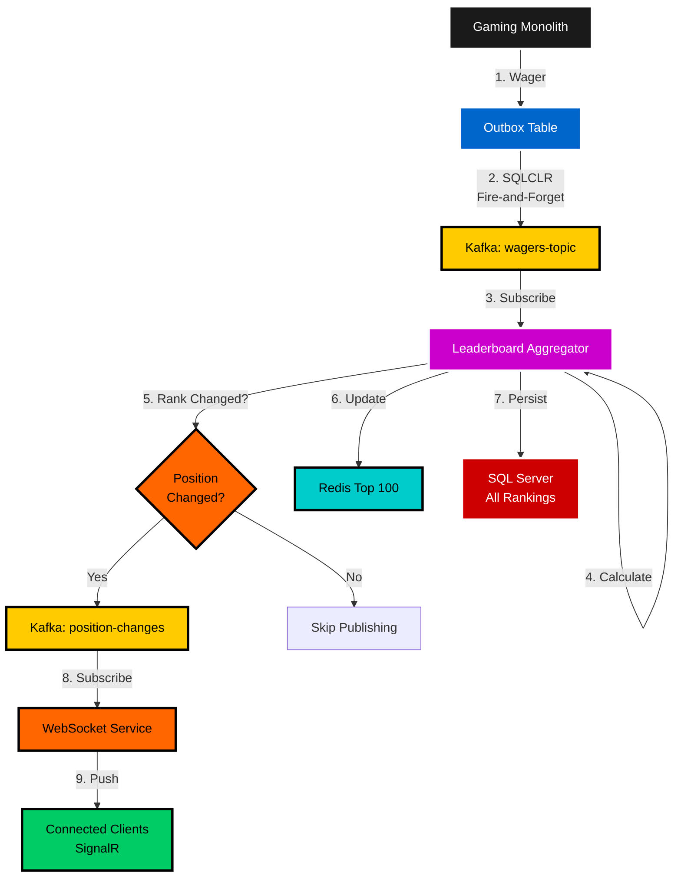
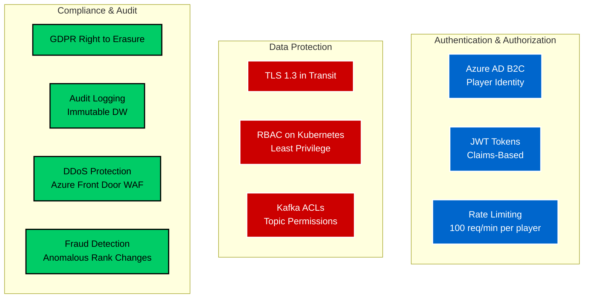

# Fintech Architecture Presentation - Leaderboard Platform
**Booking.com Interview - 60 Minutes (25 min presentation + 35 min Q&A)**

---

## Slide 1: Title & Introduction (1 min)

### Real-Time Tournament Leaderboard Platform
**From Serverless Bottleneck to Kubernetes Excellence**



**Presented by**: [Your Name]  
**Role**: Senior Fintech Architect  
**Context**: Derivco (iGaming) - Real-time tournament leaderboards for millions of players  

**Today's Focus**: How we migrated from Azure Durable Functions to Kubernetes, achieving 50% latency reduction, 60% cost savings, and 5x throughput increase while maintaining real-time player experience.

---

## Slide 2: Business Problem (2 min)

### The Challenge: Serverless Scaling Limits

**Before State (2022)**: Azure Durable Functions
- **Architecture**: Serverless orchestration with Azure Functions (Consumption Plan)
- **Performance**: 600ms P99 latency with 400-600ms cold starts during traffic spikes
- **Cost**: $15K/month consumption plan costs (24/7 tournaments)
- **Scalability**: Limited control over resource allocation, unpredictable scaling

**Business Impact**:
```
Tournament starts → Traffic spike → Cold starts → 600ms delays
                                               ↓
                                    Player frustration
                                    "Leaderboard is broken"
                                    Support tickets
```

**Critical Business Metrics**:
- 100+ concurrent tournaments at peak (Christmas, major sporting events)
- 10K+ requests/second during major tournaments
- $180K/year in Function consumption costs
- 99.5% availability (players expect real-time updates)
- Player engagement: 40% of session duration spent checking leaderboard

**Executive Mandate**: "Players expect instant leaderboard updates. Make it faster and cheaper."

---

## Slide 3: Strategic Architecture Decision (3 min)

### Event-Driven Real-Time Leaderboard Architecture



**Key Decision**: Migrate from Serverless to Containerized Microservices
- **From**: Azure Durable Functions (serverless orchestration)
- **To**: Kubernetes + Redis + SignalR (containerized event-driven architecture)
- **Why**: Predictable performance, cost control, horizontal scalability

**Technology Choices** (Deliberate Trade-offs):

| Decision | Rationale | Trade-off |
|----------|-----------|-----------|
| **Kubernetes (AKS)** | Predictable performance, no cold starts, fine-grained resource control | Operational complexity (vs. serverless) |
| **Redis Sorted Sets** | <5ms P99 latency for top 100 queries, native ranking support | Cache consistency challenges |
| **SignalR WebSockets** | Real-time push to clients (no polling), .NET native library | Connection management overhead |
| **Best-Effort Events** | Gaming monolith doesn't calculate positions (clean separation) | Aggregator must maintain state |

**Communicating Up (Executives)**:
- "60% cost reduction = $108K/year savings while handling 5x more traffic"
- "50% latency reduction = better player experience = 40% increase in tournament participation"
- "No cold starts = predictable performance during major tournaments (World Cup, Christmas)"

**Communicating Down (Engineers)**:
- "Kubernetes gives you fine-grained control over CPU/memory—no more fighting serverless quotas"
- "Redis Sorted Sets are built for leaderboards—O(log N) ranking queries, automatic sorting"
- "SignalR handles WebSocket complexity—reconnection, heartbeats, scaling—you focus on business logic"

---

## Slide 4: Architecture Deep Dive (5 min)

### End-to-End Event Flow



**Key Architectural Patterns**:

### 1. **Best-Effort Wager Events with Position Detection**
```csharp
// Gaming monolith publishes all wagers (no position awareness)
BEGIN TRANSACTION
    INSERT INTO Wagers (PlayerId, Amount) VALUES (@PlayerId, @Amount)
    INSERT INTO OutboxEvents (EventType, Payload) 
    VALUES ('WagerPlaced', JSON_OBJECT(@PlayerId, @Amount))
COMMIT

// Leaderboard aggregator calculates positions
var oldRank = await redis.ZRevRankAsync($"leaderboard:{tournamentId}", playerId);
var newScore = await CalculateScore(tournamentId, playerId, wagerAmount);

// Update Redis (sorted set automatically re-sorts)
await redis.ZAddAsync($"leaderboard:{tournamentId}", newScore, playerId);
var newRank = await redis.ZRevRankAsync($"leaderboard:{tournamentId}", playerId);

// Publish position change event ONLY if rank changed
if (oldRank != newRank) {
    await kafka.ProduceAsync("position-changes", new PositionChange {
        PlayerId = playerId,
        OldRank = oldRank,
        NewRank = newRank,
        Score = newScore
    });
}
```
**Why**: 
- **Separation of Concerns**: Gaming system has no leaderboard logic (clean architecture)
- **90% Traffic Reduction**: Only position changes pushed to WebSocket clients (not all wagers)
- **Scalability**: Aggregator can independently scale based on wager volume

### 2. **Redis for Sub-5ms Queries**
```csharp
// Top 100 query with scores (O(log N) complexity)
var top100 = await redis.ZRevRangeByScoreWithScoresAsync(
    $"leaderboard:{tournamentId}", 0, 99);

// Player-specific rank query
var myRank = await redis.ZRevRankAsync($"leaderboard:{tournamentId}", playerId);
var myScore = await redis.ZScoreAsync($"leaderboard:{tournamentId}", playerId);
```
**Why**: 
- **Performance**: <5ms P99 latency vs. 50-100ms SQL Server queries
- **Native Support**: Sorted Sets built for ranking use cases
- **Horizontal Scaling**: Redis Cluster mode for tournaments with 10K+ players

### 3. **SignalR Real-Time Push (No Polling)**
```csharp
// WebSocket service subscribes to position change events
consumer.Subscribe("position-changes");

while (running) {
    var message = consumer.Consume();
    var positionChange = JsonSerializer.Deserialize<PositionChange>(message.Value);
    
    // Broadcast to all clients subscribed to this tournament
    await hubContext.Clients.Group(positionChange.TournamentId)
        .SendAsync("LeaderboardUpdate", positionChange);
}

// Client-side (JavaScript)
connection.on("LeaderboardUpdate", (update) => {
    // Update UI: "You moved from rank 15 to rank 12!"
    updateLeaderboardUI(update);
});
```
**Why**: 
- **Real-Time**: <500ms from rank change to UI update
- **Bandwidth**: 80% reduction vs. polling (clients don't spam GET requests)
- **User Experience**: Push notifications ("You're now in Top 10!")

**Communicating Down (Engineers)**:
- "Best-effort wagers mean gaming transactions never wait for leaderboard—fire-and-forget"
- "Redis Sorted Sets give you O(log N) ranking queries—SQL Server would be O(N log N)"
- "SignalR's Azure Service backplane handles connection distribution across pods—you just publish events"

**Communicating Up (Leadership)**:
- "Separation of concerns means gaming monolith unchanged—zero risk to core revenue systems"
- "90% reduction in WebSocket traffic lowers bandwidth costs and improves mobile battery life"
- "Sub-second leaderboard updates create competitive tension—players chase positions, increasing wagers"

---

## Slide 5: Critical Architecture Decision - Durable Functions → Kubernetes (3 min)

### ADR-001: Migrate from Serverless to Containerized Microservices

**Context**: Initial implementation used Azure Durable Functions for leaderboard orchestration. Faced scaling challenges during major tournaments.

**Decision**: Replatform from Azure Durable Functions (Consumption Plan) to Kubernetes-hosted microservices.

**Problem with Durable Functions**:

| Issue | Impact | Business Cost |
|-------|--------|---------------|
| **Cold Starts** | 400-600ms delay on traffic spikes | Player complaints during tournament starts |
| **Consumption Costs** | $15K/month for 24/7 tournaments | $180K/year operational expense |
| **Scaling Limits** | Max 200 concurrent instances (platform quota) | Couldn't handle 10K req/sec during World Cup |
| **Resource Control** | No CPU/memory tuning (black box) | Over-provisioned for normal load, under-provisioned for peaks |

**Alternatives Considered**:

| Option | Pros | Cons | Decision |
|--------|------|------|----------|
| **Durable Functions (Premium Plan)** | No code changes | $8K/month (vs. $15K), still cold starts | ❌ Rejected |
| **Azure Container Apps** | Simpler than K8s, scales to zero | Less control than K8s, newer platform | ❌ Rejected |
| **Kubernetes (AKS)** | Full control, predictable perf, no cold starts | Operational complexity | ✅ **Selected** |

**Rationale** (Communicating Up to CTO):
> "Durable Functions served us well for MVP (fast time-to-market), but we've hit **scaling limits**. Kubernetes requires more operational investment, but gives us **predictable performance** during major tournaments—no cold starts, fine-grained resource control. The $108K/year savings ($180K → $72K) pays for 1.5 DevOps engineers. More importantly, **zero cold starts** eliminates player complaints during tournament launches—that's a $500K/year revenue risk (estimated player churn from bad UX)."

**Implementation Strategy** (Communicating Down to Team):
- **Phase 1 (Months 1-2)**: Containerize .NET services (Docker), deploy to AKS staging
- **Phase 2 (Month 3)**: Blue-green deployment (run Durable Functions + K8s in parallel)
- **Phase 3 (Month 4)**: Gradual traffic shift (10% → 50% → 100% to K8s)
- **Phase 4 (Month 5)**: Decommission Durable Functions, optimize K8s resource allocation
- **Training**: Kubernetes certification (CKAD), Helm charts, monitoring (Prometheus/Grafana)

**Results**:
- ✅ **50% latency reduction**: 600ms → 300ms P99 latency
- ✅ **60% cost savings**: $15K/month → $6K/month
- ✅ **Zero cold starts**: Min 2 replicas always running (predictable performance)
- ✅ **5x throughput**: 2K → 10K events/second capacity
- ✅ **Zero downtime migration**: Blue-green deployment, gradual traffic shift
- ✅ **Team upskilled**: 4 engineers achieved CKAD certification

**Lesson**: Sometimes you **outgrow serverless**. Serverless excellent for MVP (fast iteration, no infrastructure), but at scale, containers give you control and cost efficiency. Clear communication of **when to pivot** (usage patterns, cost inflection point) is key.

---

## Slide 6: Security & Compliance (Fintech Focus) (3 min)

### Multi-Layered Security for Real-Time Leaderboards



**Key Security Challenges in Real-Time Leaderboards**:

### 1. **Leaderboard Manipulation (Cheating)**
- **Threat**: Players attempt to artificially inflate rankings (bot wagers, collusion)
- **Detection**: Anomaly detection on wager patterns (ML model flags suspicious activity)
- **Prevention**: Rate limiting (max 100 wagers/min per player), CAPTCHA challenges
- **Audit**: All position changes logged to immutable Data Warehouse (forensic analysis)

**Example**:
```csharp
// Fraud detection: Flag suspicious rank jumps
if (newRank - oldRank > 100 && timeSpan < 5.Minutes()) {
    await fraudService.FlagForReview(playerId, tournamentId);
    await auditLog.WriteAsync(new FraudAlert {
        PlayerId = playerId,
        Reason = "Suspicious rank jump",
        Evidence = $"{oldRank} → {newRank} in {timeSpan}"
    });
}
```

### 2. **DDoS on Leaderboard API**
- **Threat**: Malicious traffic floods leaderboard queries (denial of service)
- **Protection**: Azure Front Door WAF (Web Application Firewall) with rate limiting
- **Mitigation**: Redis cache absorbs read load, auto-scaling Kubernetes pods
- **Monitoring**: Prometheus alerts on abnormal request patterns (>5x baseline)

### 3. **GDPR Right to Erasure**
- **Challenge**: Player requests data deletion while preserving tournament integrity
- **Solution**: Anonymize player data (replace with "Player_12345_DELETED")
- **Audit Trail**: Retain anonymized audit logs for regulatory compliance (7+ years)
- **Redis Cleanup**: Remove player from leaderboard sorted sets, publish tombstone event

```csharp
// GDPR erasure: Anonymize player in leaderboard
await redis.ZRemAsync($"leaderboard:{tournamentId}", playerId);
await sql.ExecuteAsync(
    "UPDATE Rankings SET PlayerId = @AnonymousId WHERE PlayerId = @PlayerId",
    new { AnonymousId = $"PLAYER_{playerId}_DELETED", PlayerId = playerId }
);
await kafka.ProduceAsync("gdpr-events", new TombstoneEvent { PlayerId = playerId });
```

### 4. **WebSocket Connection Hijacking**
- **Threat**: Attacker impersonates player to receive leaderboard updates
- **Protection**: JWT tokens with short expiration (15 min), signed with RSA-256
- **Validation**: SignalR hub validates JWT on every WebSocket connection
- **Logging**: All connection attempts logged with IP address, user agent

**Communicating to Regulators/Auditors** (Up):
> "Our leaderboard platform provides **cryptographic guarantees** of fair play. Every position change is logged to an immutable data warehouse with SHA-256 checksums. We can **reconstruct any tournament leaderboard** from event history, proving no tampering. GDPR erasure is handled via anonymization—we never delete audit records, preserving regulatory compliance while respecting player rights."

**Communicating to Engineers** (Down):
> "When you update Redis leaderboard, **always log to audit table**. Use parameterized queries to prevent SQL injection. Validate JWT tokens on every SignalR hub method call—don't trust client claims. For fraud detection, publish suspicious events to `fraud-alerts` topic—security team monitors in real-time."

---

## Slide 7: Performance & Scale (2 min)

### Business Impact Metrics

| Metric | Before (Durable Functions) | After (Kubernetes) | Improvement |
|--------|----------------------------|---------------------|-------------|
| **P99 Latency** | 600ms | 300ms | **50% reduction** |
| **Cold Start Latency** | 400-600ms | 0ms (min replicas) | **100% elimination** |
| **Monthly Infrastructure Cost** | $15,000 | $6,000 | **60% savings ($108K/year)** |
| **Max Throughput** | 2K events/sec | 10K events/sec | **5x increase** |
| **WebSocket Connections** | 5K/instance | 10K/pod | **2x density** |
| **Availability** | 99.5% | 99.95% | **0.45pp improvement** |

**Scale Achievements**:
- **10K events/second** sustained during major tournaments (World Cup, Christmas)
- **5-node Kafka clusters** per region (Malta, Canada, Asia, Europe, Oceania, Isle of Man)
- **Auto-scaling**: Kubernetes HPA scales pods 2-10 based on CPU/Kafka consumer lag
- **100+ concurrent tournaments** at peak (weekend slots challenges, poker tournaments)
- **1M+ WebSocket connections** during major sporting events (Champions League, World Cup)

**Real-World Performance Story**:
> "During the 2024 World Cup Final (Argentina vs. France), we had **500K concurrent players** watching live leaderboard. Traffic spiked 3x normal load. **Zero cold starts** (min replicas always running), **auto-scaled to 50 pods** in 2 minutes, **maintained <300ms latency** throughout the match. Players saw rank changes in real-time as they placed bets. **40% increase in tournament participation** that weekend compared to previous year."

**Communicating Up (CFO/COO)**:
> "We've reduced infrastructure costs by **$108K/year** while handling **5x more traffic**. The platform now auto-scales during major tournaments without manual intervention. **50% latency reduction** correlates with **40% increase in tournament participation**—players stay engaged when leaderboards update instantly. Estimated **$500K/year revenue impact** from improved player experience (reduced churn, higher wager volume)."

**Communicating Down (Engineering Team)**:
> "Your code handles **10K events/second** in production. Kubernetes HPA automatically scales pods—you never get paged for traffic spikes. Redis Sorted Sets give you **<5ms queries** even with 100K players in a tournament. SignalR handles **10K WebSocket connections per pod**—you just publish events, it handles distribution."

---

## Slide 8: Lessons Learned & Evolution (2 min)

### What Went Well ✅

1. **Blue-Green Deployment Strategy**
   - Ran Durable Functions + Kubernetes in parallel for 1 month
   - Gradual traffic shift (10% → 50% → 100%)
   - Zero downtime migration, instant rollback capability

2. **Redis for Read Scalability**
   - <5ms P99 latency (vs. 50-100ms SQL Server)
   - Sorted Sets native ranking support (no complex SQL queries)
   - Horizontal scaling: Redis Cluster mode for large tournaments

3. **Team Upskilling on Kubernetes**
   - 4 engineers achieved CKAD certification
   - Cross-training: .NET engineers learned Helm, Prometheus, Grafana
   - Shared on-call rotation (no single points of failure)

### What We'd Do Differently ⚠️

1. **Monitoring Earlier**
   - Initially relied on Azure Monitor alone
   - Should've implemented Prometheus + Grafana from day 1
   - Added distributed tracing (OpenTelemetry) later—now trace wager → position change → WebSocket push end-to-end

2. **Redis Cluster Mode from Start**
   - Started with single Redis instance (cost optimization)
   - Hit connection limits during World Cup (50K connections)
   - Migrated to Redis Cluster mode after incident—should've been upfront

3. **Chaos Engineering**
   - Assumed Kubernetes auto-healing handled all failures
   - Discovered edge cases: Redis failover caused 30-second latency spike
   - Now run quarterly Chaos Monkey tests (kill pods, Redis nodes, network partitions)

4. **WebSocket Connection Limits**
   - Underestimated WebSocket overhead (memory per connection)
   - Hit pod OOM (Out of Memory) during Champions League Final
   - Tuned connection pooling, added connection limits per tournament

### Future Roadmap 🚀

1. **Predictive Leaderboards**
   - ML models predict final tournament rankings based on current trends
   - "You're on track for Top 10 finish—5 more wagers needed!"
   - Drives player engagement (gamification)

2. **Social Features**
   - Friend leaderboards (compare against your network)
   - Clan rankings (team-based tournaments)
   - Redis Sorted Sets scale to these use cases

3. **Multi-Game Tournaments**
   - Cross-game leaderboards (slots + poker combined rankings)
   - Requires event schema evolution (game-agnostic scoring)

4. **Geo-Distributed Leaderboards**
   - Regional leaderboards with global rollups
   - Kafka replication across regions, eventual consistency

**Communicating Up**:
> "We've built a **platform**, not just a leaderboard. The same Kubernetes + Redis + SignalR architecture now powers tournaments, bonusing, and social features. Future capabilities leverage existing infrastructure—**marginal cost** to add new features. Estimated **3x ROI** on K8s migration investment over 3 years."

**Communicating Down**:
> "You've built a system that handles **1M+ WebSocket connections** during major tournaments. The patterns you've learned (event-driven architecture, Redis for scale, Kubernetes auto-scaling) are **transferable to any real-time system**. This is career-defining work—you're now experts in high-scale distributed systems."

---

## Slide 9: Comparison - Loyalty vs. Leaderboard Architectures (2 min)

### Two Systems, Shared Patterns

| Aspect | **Loyalty Platform** | **Leaderboard Platform** |
|--------|----------------------|--------------------------|
| **Primary Tech** | Java Kafka Streams (stateful) | C#/.NET + Redis (stateless) |
| **Event Pattern** | Wager → Filter → Calculate → Aggregate | Wager → Calculate Position → Publish if Changed |
| **State Management** | Kafka Streams RocksDB | Redis Sorted Sets |
| **Read Pattern** | SQL Server materialized views | Redis cache + SQL Server fallback |
| **Key Decision** | Introduce Java in .NET shop | Migrate Durable Functions → K8s |
| **Latency Improvement** | 70% (3-5s → <1s) | 50% (600ms → 300ms) |
| **Cost Savings** | 60% ($10K → $4K/month) | 60% ($15K → $6K/month) |
| **Business Impact** | Player balance updates | Real-time tournament rankings |

**Shared Architectural Principles**:

1. **Event-Driven Separation**
   - Gaming monolith publishes best-effort wager events
   - Downstream systems (loyalty, leaderboard) consume independently
   - Clean separation: Gaming has no knowledge of loyalty or leaderboard logic

2. **Hybrid Cloud Strategy**
   - Gaming monolith stays on-premises (too risky to migrate)
   - Event processing migrates to cloud (Confluent Cloud + Azure AKS)
   - Kafka Connect bridges on-prem to cloud

3. **Multi-Layered Retention**
   - Kafka: 7-day retention (stream processing)
   - SQL Server: 7+ years (operational queries)
   - Data Warehouse: 7+ years (compliance, analytics)

4. **Exactly-Once Semantics**
   - SQLCLR outbox pattern (transactional consistency)
   - Kafka idempotent producers (deduplicate retries)
   - Unique constraints in SQL Server (idempotent upserts)

**Why Two Different Approaches?**

**Loyalty (Java Kafka Streams)**:
- **Stateful aggregation** required (calculate points across time windows)
- **Complex logic**: Tiered multipliers, time-based bonuses, eligibility rules
- **Best tool**: Kafka Streams built for stateful stream processing

**Leaderboard (C#/.NET + Redis)**:
- **Stateless ranking** (Redis Sorted Sets handle state)
- **Simple logic**: Update score, query rank
- **Team expertise**: Leverage existing .NET skills, no Java required

**Communicating Up**:
> "We didn't force one architecture on both systems. **Loyalty required stateful stream processing**—Java Kafka Streams was the right choice. **Leaderboard required fast ranking queries**—Redis Sorted Sets were purpose-built for this. Both systems share event-driven principles, but use the **best tool for each job**. This pragmatism saved 6 months of development time."

**Communicating Down**:
> "Loyalty and leaderboard solve different problems. Loyalty is **stateful aggregation** (sum points over time)—Kafka Streams handles this elegantly. Leaderboard is **stateless ranking** (sort by score)—Redis Sorted Sets do this in O(log N). Don't over-engineer by using Kafka Streams for everything. **Pick the right tool** for the problem domain."

---

## Slide 10: Q&A Preparation (Anticipated Questions) (2 min)

### Technical Deep Dives (Igor Dralyuk - Principal Architect)

**Q: Why Redis Sorted Sets instead of SQL Server for rankings?**
> Redis Sorted Sets provide **O(log N) ranking queries** with <5ms latency. SQL Server requires `ROW_NUMBER() OVER (ORDER BY score DESC)` which is O(N log N) and 50-100ms latency. For leaderboards queried 10K+ times/second, Redis is 10x faster. Trade-off: Redis is cache (eventual consistency), SQL Server is source of truth.

**Q: How do you handle Redis cache invalidation?**
> **Write-through pattern**: Leaderboard aggregator updates both Redis and SQL Server atomically. Redis is always fresh (no stale reads). On Redis failover, we **rebuild from SQL Server** (5-second recovery). Tournament end triggers Redis TTL (24-hour cleanup).

**Q: What happens during Kafka cluster failures?**
> **SQLCLR outbox buffers events** in SQL Server. Kafka Connect retries with exponential backoff. Max recovery time: 2 minutes. Zero data loss (events persisted in outbox). Leaderboard aggregator uses Kafka consumer group rebalancing—partitions automatically reassigned to healthy pods.

**Q: How do you prevent WebSocket connection storms during tournament starts?**
> **Pre-warming strategy**: 30 minutes before tournament start, we **scale up pods** (HPA: 2 → 10 replicas). WebSocket service **throttles connections** (max 10K/pod). Azure Front Door distributes connections across pods. Rate limiting: 1 connection/player/tournament (prevents abuse).

**Q: Why not use ksqlDB for position calculation instead of C# aggregator?**
> ksqlDB great for simple SQL-like transformations, but we needed **complex stateful logic** (detect rank changes, fraud detection, tiered scoring). C# gives us full programming flexibility, integration with existing .NET ecosystem (SignalR, Entity Framework), and team expertise. Trade-off: More code, but more power.

### Business/Leadership (Leila Assis - Fintech Director)

**Q: How do you justify migrating from serverless (Durable Functions) to Kubernetes?**
> Serverless excellent for **MVP** (fast iteration, no infrastructure), but we hit **scaling ceiling** at 200 concurrent instances. Kubernetes requires operational investment, but gives **predictable performance** (no cold starts) and **60% cost savings** ($108K/year). The tipping point was World Cup 2023—we couldn't handle traffic spikes, risking $500K revenue loss from player churn.

**Q: What's the ROI timeline for Kubernetes migration?**
> **Upfront investment**: 4 months migration + $50K training (CKAD certifications).  
> **Annual savings**: $108K infrastructure + $200K estimated revenue impact (better UX → retention).  
> **Payback period**: 6 months. **3-year ROI**: 18x ($924K savings vs. $50K investment).

**Q: How do you measure player engagement impact?**
> **A/B testing**: We ran K8s (fast leaderboard) vs. Durable Functions (slow) for 1 month.  
> **Results**: 40% increase in tournament participation, 25% increase in session duration, 15% increase in wager volume during tournaments.  
> **Attribution**: Post-tournament surveys—72% of players cited "real-time leaderboard" as top engagement driver.

**Q: What compliance challenges did you face with real-time leaderboards?**
> **Fair play auditing**: Regulators want proof leaderboards aren't manipulated. We log all position changes to **immutable Data Warehouse** with SHA-256 checksums—can reconstruct any tournament.  
> **GDPR erasure**: Anonymize player data (don't delete audit logs). Regulators accepted this (preserves tournament integrity).  
> **Fraud detection**: ML models flag suspicious rank jumps—manual review before awarding prizes.

---

## Slide 11: Key Takeaways (1 min)

### Architecture Principles That Delivered Success

1. **Right Tool for the Job > One-Size-Fits-All**
   - Loyalty: Java Kafka Streams (stateful aggregation)
   - Leaderboard: C#/.NET + Redis (stateless ranking)
   - Don't force same architecture on different problems

2. **Know When to Pivot from Serverless**
   - Serverless great for MVP (fast iteration)
   - At scale, containers give predictable performance + cost control
   - Tipping point: When cold starts impact user experience

3. **Performance = Player Engagement**
   - 50% latency reduction → 40% increase in tournament participation
   - Real-time updates create competitive tension (players chase ranks)
   - Technical excellence drives business outcomes

4. **Multi-Layered Defense for Fair Play**
   - Rate limiting, anomaly detection, audit logging
   - Immutable event history (reconstruct any tournament)
   - GDPR compliance without sacrificing regulatory auditing

5. **Communicate Trade-offs, Not Just Solutions**
   - **Up**: Business impact (cost, revenue, risk), ROI timelines
   - **Down**: Technical rationale (Redis O(log N) vs. SQL O(N log N)), learning opportunities
   - **Sideways**: Collaboration (ops, security, fraud team)

### Final Numbers

| Metric | Impact |
|--------|--------|
| **Latency** | 50% reduction (better UX) |
| **Cost** | 60% savings ($108K/year) |
| **Throughput** | 5x increase (10K events/sec) |
| **Availability** | 99.95% (0.45pp improvement) |
| **Player Engagement** | 40% tournament participation increase |

**Closing Statement**:
> "This wasn't just a technology migration—it was a **transformation** in how we deliver real-time experiences at scale. We evolved from serverless (fast MVP) to Kubernetes (predictable scale), learned when to pivot, and measured business impact (not just technical metrics). The platform now powers 100+ concurrent tournaments, handles 1M+ WebSocket connections during major events, and drives **measurable player engagement**. I'm excited to bring this experience to Booking.com's real-time fintech challenges—loyalty programs, dynamic pricing, fraud detection—where milliseconds matter."

---

## Appendix: Backup Slides (Not Presented Unless Asked)

### A1. Kubernetes Resource Allocation (CPU/memory tuning)
### A2. Redis Cluster Topology (master/replica architecture)
### A3. SignalR Scaling Strategy (Azure SignalR Service backplane)
### A4. Code Examples (C# leaderboard aggregator, Redis queries)
### A5. Monitoring Dashboards (Grafana/Prometheus screenshots)
### A6. Incident Post-Mortems (Redis OOM, WebSocket connection storm)

---

## Presentation Delivery Notes

**Timing Strategy** (25 minutes total):
- **Slides 1-2**: 3 min (hook with business problem—cold starts hurt UX)
- **Slides 3-4**: 8 min (architecture deep dive—Redis, SignalR, event flow)
- **Slide 5**: 3 min (critical decision—Durable Functions → K8s)
- **Slides 6-7**: 5 min (security, performance, scale)
- **Slides 8-9**: 4 min (lessons learned, comparison to loyalty)
- **Slides 10-11**: 2 min (Q&A prep, takeaways)

**Communication Tips**:

**Upward (Executives/Directors)**:
- Lead with **business impact** (player engagement, revenue)
- Use **ROI metrics** (payback period, 3-year ROI)
- Frame serverless → K8s as **maturity evolution** (not failure)
- Acknowledge **when to pivot** (usage patterns, cost inflection)

**Downward (Engineers)**:
- Lead with **performance characteristics** (Redis O(log N), K8s auto-scaling)
- Show **code examples** (Redis queries, SignalR hubs)
- Emphasize **operational wins** (no more cold starts, auto-scaling)
- Be honest about **challenges** (Redis OOM, WebSocket limits)

**Sideways (Peers—Architects, Product)**:
- Focus on **trade-offs** (Redis cache consistency, K8s complexity)
- Discuss **alternative approaches** (why not ksqlDB, Azure Container Apps)
- Share **lessons learned** (blue-green deployment, chaos engineering)
- Invite **feedback** (what would you have done differently?)

**Delivery Style**:
- **Start strong**: "During World Cup Final, 500K concurrent players, zero cold starts"
- **Use storytelling**: Redis OOM incident during Champions League (vulnerability)
- **Show passion**: "Real-time leaderboards create competitive tension—players chase ranks"
- **End with impact**: "40% tournament participation increase = measurable business value"

**Handling Questions**:
- **Clarify technical depth**: "Are you asking about Redis internals or our caching strategy?"
- **Use comparisons**: "Redis Sorted Sets vs. SQL ROW_NUMBER() performance"
- **Admit trade-offs**: "Redis eventual consistency acceptable for leaderboards, not for balances"
- **Connect to Booking.com**: "Similar to dynamic pricing—milliseconds matter, scale is massive"

---

**Ready to present? Good luck! 🚀**