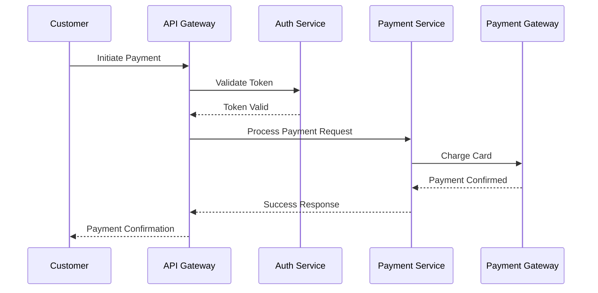

# Diagrams Directory

## Overview
Store architecture diagrams here to visualize system design.

## Recommended Diagram Types

### 1. C4 Model Diagrams
- **Level 1 - System Context**: System and external dependencies
- **Level 2 - Container**: High-level containers/components
- **Level 3 - Component**: Component internals
- **Level 4 - Code**: Class diagrams (if needed)

### 2. Sequence Diagrams
- Key user flows
- Integration patterns
- Authentication flows
- Payment processing flows

### 3. Deployment Diagrams
- Infrastructure architecture
- Network topology
- Cloud resources
- Environments (dev, staging, prod)

### 4. Data Flow Diagrams
- Data movement between components
- ETL/ELT processes
- Event flows

### 5. Entity Relationship Diagrams
- Database schema
- Domain model relationships

## Recommended Tools

### Online Tools
- **draw.io / diagrams.net**: Free, versatile
- **Lucidchart**: Professional diagrams
- **Miro**: Collaborative whiteboarding
- **Excalidraw**: Hand-drawn style diagrams

### Code-Based Diagramming
- **PlantUML**: Text-based UML diagrams
- **Mermaid**: Markdown-compatible diagrams
- **Structurizr**: C4 model diagrams as code
- **D2**: Modern declarative diagram language

### Architecture-Specific
- **Archi**: ArchiMate modeling
- **CloudCraft**: AWS architecture diagrams
- **Terraform Visual**: Infrastructure visualization

## Diagram Naming Convention
```
[type]-[name]-[version].png

Examples:
- c4-system-context-v1.png
- sequence-payment-flow-v2.png
- deployment-production-v1.png
- erd-domain-model-v1.png
```

## Storing Diagrams

### Source Files
Keep editable source files:
- `.drawio` for draw.io diagrams
- `.puml` for PlantUML
- `.mmd` for Mermaid

### Export Formats
- PNG for Confluence/presentations
- SVG for web/high quality
- PDF for documentation

## Example PlantUML C4 Context Diagram

```plantuml
@startuml
!include https://raw.githubusercontent.com/plantuml-stdlib/C4-PlantUML/master/C4_Context.puml

LAYOUT_WITH_LEGEND()

title System Context Diagram for [System Name]

Person(customer, "Customer", "A customer of the fintech platform")
Person(admin, "Admin User", "Internal administrator")

System(system, "[System Name]", "Fintech platform for [purpose]")

System_Ext(payment, "Payment Gateway", "External payment processing")
System_Ext(kyc, "KYC Provider", "Identity verification")
System_Ext(bank, "Banking System", "Core banking integration")

Rel(customer, system, "Uses", "HTTPS")
Rel(admin, system, "Manages", "HTTPS")
Rel(system, payment, "Processes payments", "REST API")
Rel(system, kyc, "Verifies identity", "REST API")
Rel(system, bank, "Transfers funds", "SFTP/API")

@enduml
```

## Example Mermaid Sequence Diagram



## Tips for Interview Presentation

### Keep It Simple
- One concept per diagram
- Avoid clutter
- Use consistent notation
- Include legends

### Use Color Effectively
- Highlight critical paths
- Differentiate system types
- Show security boundaries
- Indicate data sensitivity

### Size Appropriately
- Readable on screen share
- High contrast for visibility
- Test on projector if possible

### Tell a Story
- Start with context (C4 Level 1)
- Zoom into details progressively
- Connect diagrams to narrative
- Show before/after for improvements

---
*Create diagrams that support your architecture story for the Booking.com interview.*
