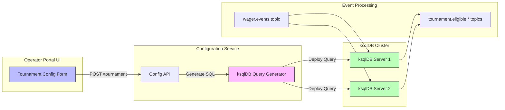

# Leaderboard Platform - Architecture Evolution Diagram

```mermaid
graph TB
    subgraph "Phase 1: Initial (Azure Durable Functions)"
        KF1[Kafka Events]
        DF1[Durable Functions<br/>Orchestrator]
        DF2[Activity: Fetch Wagers]
        DF3[Activity: Aggregate Scores]
        DF4[Activity: Rank Players]
        DF5[Activity: Publish]
        R1[(Redis)]
        T1[(Table Storage)]
        
        KF1 --> DF1
        DF1 --> DF2
        DF2 --> DF3
        DF3 --> DF4
        DF4 --> DF5
        DF5 --> R1
        DF5 --> T1
        
        style DF1 fill:#faa,stroke:#333
        style DF2 fill:#fcc,stroke:#333
        style DF3 fill:#fcc,stroke:#333
        style DF4 fill:#fcc,stroke:#333
        style DF5 fill:#fcc,stroke:#333
    end
    
    subgraph "Problems Encountered"
        P1[❌ Unpredictable Scaling]
        P2[❌ Cold Starts 2-5s]
        P3[❌ High Cost at Scale]
        P4[❌ Orchestration Overhead]
        P5[❌ Limited Control]
    end
    
    subgraph "Phase 2: Migrated (Kubernetes)"
        KF2[Kafka Events]
        K1[Score Aggregator<br/>Pods 3-10]
        K2[Ranker<br/>Pods 3-5]
        K3[Publisher<br/>Pods 2]
        R2[(Redis)]
        T2[(Table Storage)]
        
        KF2 --> K1
        K1 --> K2
        K2 --> K3
        K3 --> R2
        K3 --> T2
        
        style K1 fill:#afa,stroke:#333
        style K2 fill:#afa,stroke:#333
        style K3 fill:#afa,stroke:#333
    end
    
    subgraph "Improvements Achieved"
        I1[✅ 50% Latency Reduction<br/>5s → <1s]
        I2[✅ 60% Cost Reduction]
        I3[✅ 99.99% Availability]
        I4[✅ Pre-Warming Capability]
        I5[✅ Fine-Grained Control]
    end
```



## Migration Timeline

### Month 1-2: Assessment & Planning
- Performance profiling of Durable Functions
- Identified bottlenecks (orchestration overhead)
- Cost analysis (high execution count)
- Kubernetes architecture design

### Month 3-4: Parallel Implementation
- Built Kubernetes version alongside Functions
- Shadow mode: Both process same events
- Compare results for validation
- Performance testing under load

### Month 5: Gradual Cutover
- Week 1: 10% of tournaments to K8s
- Week 2: 50% of tournaments to K8s
- Week 3: 90% of tournaments to K8s
- Week 4: 100% migration complete

### Month 6: Decommission
- Functions turned off
- Cost savings validated
- Performance improvements confirmed
- Team trained on K8s operations

---

## ksqlDB Dynamic Configuration - Architecture



### Example Configuration Flow

**1. Operator Input (UI Form)**:
```json
{
  "tournamentName": "Weekend Slots Challenge",
  "startDate": "2024-11-15T00:00:00Z",
  "endDate": "2024-11-17T23:59:59Z",
  "eligibleGames": ["slots"],
  "minWager": 10.00,
  "playerSegments": ["VIP", "Gold"]
}
```

**2. Generated ksqlDB Query**:
```sql
CREATE STREAM tournament_weekend_slots_123 AS
SELECT 
  playerId,
  wagerAmount,
  timestamp,
  gameId
FROM wager_events
WHERE 
  gameCategory = 'slots'
  AND wagerAmount >= 10.00
  AND playerSegment IN ('VIP', 'Gold')
  AND CAST(timestamp AS TIMESTAMP) >= '2024-11-15T00:00:00Z'
  AND CAST(timestamp AS TIMESTAMP) <= '2024-11-17T23:59:59Z'
EMIT CHANGES;
```

**3. Deployed to ksqlDB**:
```bash
POST /ksql HTTP/1.1
Host: ksqldb-server:8088
Content-Type: application/json

{
  "ksql": "CREATE STREAM tournament_weekend_slots_123...",
  "streamsProperties": {
    "ksql.streams.auto.offset.reset": "latest"
  }
}
```

**4. Result**:
- Tournament live in < 1 minute
- No code deployment
- No engineering involvement
- Operator self-service achieved

---

## Scaling Behavior Comparison

### Azure Durable Functions (Before)

```
Tournament Start (100 events/sec spike)
    ↓
Cold Start Delay: 2-5 seconds
    ↓
Instances Scale: 1 → 5 → 12 → 20 (unpredictable)
    ↓
Orchestration Overhead: +500ms per event
    ↓
Total Latency: 2-5 seconds
    ↓
Cost: $$$$ (high execution count)
```

### Kubernetes (After)

```
Tournament Start (100 events/sec spike)
    ↓
Pre-Warmed: Already at 10 replicas (30 min before)
    ↓
HPA Scaling: 10 → 15 → 20 (predictable, CPU-based)
    ↓
Direct Processing: No orchestration overhead
    ↓
Total Latency: <1 second
    ↓
Cost: $$ (reserved instances, predictable)
```

---

## Redis Leaderboard Data Structure

### Sorted Set Implementation

```redis
# Add/update player score
ZADD leaderboard:tournament_123 4500.00 player-456
ZADD leaderboard:tournament_123 3800.00 player-789
ZADD leaderboard:tournament_123 5200.00 player-234

# Get top 10 players with scores
ZREVRANGE leaderboard:tournament_123 0 9 WITHSCORES
# Returns:
# 1) "player-234"  # Rank 1
# 2) "5200.00"
# 3) "player-456"  # Rank 2
# 4) "4500.00"
# 5) "player-789"  # Rank 3
# 6) "3800.00"
# ... (up to 10)

# Get specific player's rank
ZREVRANK leaderboard:tournament_123 player-456
# Returns: 1 (zero-indexed, so rank 2)

# Get player's score
ZSCORE leaderboard:tournament_123 player-456
# Returns: 4500.00

# Get total player count
ZCARD leaderboard:tournament_123
# Returns: 10247 (total participants)

# Get player's position in percentile
# (e.g., top 5%)
ZREVRANK leaderboard:tournament_123 player-456
# Rank 1 out of 10247 = top 0.01%
```

### Performance Characteristics

| Operation | Complexity | Latency (P95) |
|-----------|-----------|---------------|
| ZADD | O(log N) | <5ms |
| ZREVRANGE (top 10) | O(log N + 10) | <3ms |
| ZREVRANK | O(log N) | <2ms |
| ZSCORE | O(1) | <1ms |

### Memory Optimization

```
Tournament with 10,000 players:
- Key: tournament:123 (string) = 20 bytes
- Member: player-456 (string) = 15 bytes avg
- Score: 4500.00 (double) = 8 bytes

Per player: 15 + 8 = 23 bytes
Total: 10,000 × 23 = 230 KB

Redis overhead: ~2x
Total memory: ~500 KB per tournament

50 concurrent tournaments = 25 MB (negligible)
```

---

## Pre-Warming Strategy

### CronJob Configuration (Kubernetes)

```yaml
apiVersion: batch/v1
kind: CronJob
metadata:
  name: tournament-prewarmer
spec:
  schedule: "30 23 * * 5"  # 23:30 every Friday (30 min before midnight tournaments)
  jobTemplate:
    spec:
      template:
        spec:
          containers:
          - name: prewarmer
            image: leaderboard-prewarmer:latest
            command:
            - /bin/sh
            - -c
            - |
              # Scale up processor pods
              kubectl scale deployment score-aggregator --replicas=15
              kubectl scale deployment ranker --replicas=10
              
              # Pre-populate Redis with tournament metadata
              redis-cli -h $REDIS_HOST HMSET tournament:123 \
                name "Weekend Slots Challenge" \
                startTime "2024-11-16T00:00:00Z" \
                endTime "2024-11-17T23:59:59Z" \
                status "pending"
              
              # Validate ksqlDB queries
              curl -X POST $KSQLDB_URL/ksql \
                -d '{"ksql":"SHOW STREAMS;"}'
```

### Benefits Achieved

- ✅ Zero cold starts at tournament launch
- ✅ Smooth player experience from minute one
- ✅ Predictable scaling behavior
- ✅ Confidence in capacity planning
