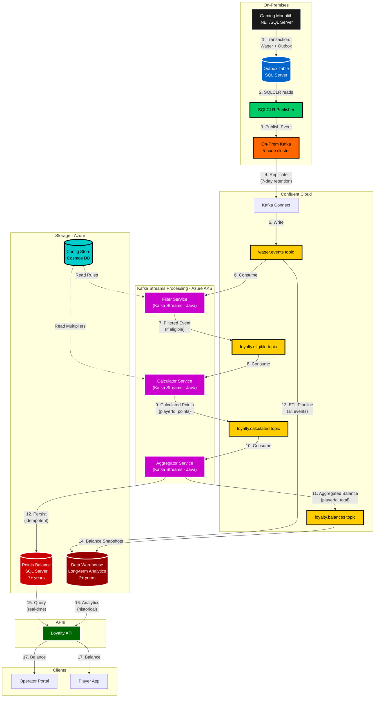

# Loyalty Platform - Data Flow Diagram



**Data Flow Legend** (Colorblind-friendly):
- **Black (#1a1a1a)**: Gaming monolith (.NET/SQL Server)
- **Blue (#0066cc)**: Outbox table (SQL Server)
- **Green (#00cc66)**: SQLCLR publisher
- **Orange (#ff6600)**: Kafka infrastructure (7-day retention)
- **Yellow (#ffcc00)**: Kafka topics
- **Purple (#cc00cc)**: Stream processing services (Java/Kafka Streams)
- **Cyan (#00cccc)**: Configuration (Cosmos DB)
- **Red (#cc0000)**: SQL Server persistence (7+ years)
- **Dark Red (#990000)**: Data Warehouse (7+ years)
- **Dark Green (#006600)**: Loyalty API

**Key Architectural Points**:
1. **Kafka retention: 7 days** - Optimized for stream processing, not long-term storage
2. **SQL Server materialized views** - Real-time OLTP queries, 7+ years compliance retention
3. **Data Warehouse** - Long-term analytics, regulatory compliance, business intelligence
4. **ETL from Kafka** - All events archived for audit trail and historical analysis

## Event Schemas

### 1. Wager Event (wager.events)
```json
{
  "wagerId": "uuid-123",
  "playerId": "player-456",
  "operatorId": "operator-789",
  "gameId": "slots-ultimate",
  "gameCategory": "slots",
  "wagerAmount": 100.00,
  "currency": "USD",
  "playerSegment": "VIP",
  "jurisdiction": "Malta",
  "timestamp": "2024-11-11T10:30:00Z"
}
```

### 2. Eligible Event (loyalty.eligible)
```json
{
  "wagerId": "uuid-123",
  "playerId": "player-456",
  "operatorId": "operator-789",
  "wagerAmount": 100.00,
  "gameCategory": "slots",
  "timestamp": "2024-11-11T10:30:00Z",
  "eligibilityRuleVersion": "v2.3"
}
```

### 3. Calculated Points (loyalty.calculated)
```json
{
  "wagerId": "uuid-123",
  "playerId": "player-456",
  "operatorId": "operator-789",
  "pointsEarned": 10.0,
  "wagerAmount": 100.00,
  "multiplier": 0.1,
  "timestamp": "2024-11-11T10:30:01Z"
}
```

### 4. Balance Update (loyalty.balances)
```json
{
  "playerId": "player-456",
  "operatorId": "operator-789",
  "pointsBalance": 460.0,
  "lastWagerId": "uuid-123",
  "lastUpdated": "2024-11-11T10:30:02Z",
  "version": 123
}
```

## Processing Stages Detail

### Stage 1: Eligibility Filter
**Input**: wager.events  
**Output**: loyalty.eligible

**Logic**:
```kotlin
wagerEventsStream
  .filter { event -> 
    val rules = operatorConfig[event.operatorId]
    rules.eligibleGames.contains(event.gameCategory) &&
    event.wagerAmount >= rules.minWagerAmount &&
    rules.eligibleSegments.contains(event.playerSegment)
  }
  .to("loyalty.eligible")
```

### Stage 2: Points Calculation
**Input**: loyalty.eligible  
**Output**: loyalty.calculated

**Logic**:
```kotlin
eligibleEventsStream
  .mapValues { event ->
    val config = operatorConfig[event.operatorId]
    val multiplier = config.getMultiplier(
      gameCategory = event.gameCategory,
      playerTier = getPlayerTier(event.playerId)
    )
    
    PointsCalculated(
      playerId = event.playerId,
      pointsEarned = event.wagerAmount * multiplier,
      multiplier = multiplier
    )
  }
  .to("loyalty.calculated")
```

### Stage 3: Balance Aggregation
**Input**: loyalty.calculated  
**Output**: loyalty.balances + SQL persist

**Logic**:
```kotlin
calculatedPointsStream
  .groupByKey { it.playerId }
  .aggregate(
    initializer = { PlayerBalance(points = 0.0) },
    aggregator = { playerId, newPoints, currentBalance ->
      currentBalance.copy(
        points = currentBalance.points + newPoints.pointsEarned,
        lastUpdated = newPoints.timestamp,
        version = currentBalance.version + 1
      )
    }
  )
  .toStream()
  .foreach { playerId, balance ->
    persistToSQL(playerId, balance) // Idempotent write
  }
```

## Outbox Pattern Implementation

**Problem**: Ensure transactional consistency between wager processing and event publishing

**Solution**: Outbox pattern with SQLCLR

```sql
-- Wager processing stored procedure
CREATE PROCEDURE ProcessWager
  @PlayerId UNIQUEIDENTIFIER,
  @WagerAmount DECIMAL(18,2),
  @GameId VARCHAR(50)
AS
BEGIN TRANSACTION
  -- 1. Process wager
  INSERT INTO Wagers (PlayerId, Amount, GameId, Timestamp)
  VALUES (@PlayerId, @WagerAmount, @GameId, GETUTCDATE())
  
  -- 2. Write to outbox (same transaction)
  INSERT INTO WagerOutbox (WagerId, EventData, Published)
  VALUES (
    SCOPE_IDENTITY(),
    JSON_QUERY('{"playerId":"' + CAST(@PlayerId AS VARCHAR(36)) + '",...}'),
    0  -- Not yet published
  )
COMMIT TRANSACTION

-- SQLCLR stored procedure (runs asynchronously)
CREATE PROCEDURE PublishOutboxEvents
AS EXTERNAL NAME KafkaPublisher.OutboxPublisher.Publish
```

**Benefits**:
- Transactional consistency (wager + event in same TX)
- At-least-once delivery guarantee
- No event loss (outbox persisted before Kafka publish)
- Asynchronous publishing doesn't block wager processing

## Idempotency Strategy

**Problem**: At-least-once delivery means duplicate events possible

**Solution**: Track processed wagerIds

```sql
-- Before processing
SELECT wagerId FROM LoyaltyTransaction WHERE wagerId = ?

-- If not exists:
BEGIN TRANSACTION
  INSERT INTO LoyaltyTransaction (
    wagerId, playerId, points, eventOffset, timestamp
  ) VALUES (?, ?, ?, ?, ?)
  
  UPDATE PlayerBalance 
  SET points = points + ?,
      lastUpdated = ?,
      version = version + 1
  WHERE playerId = ?
COMMIT
```

## Scalability Patterns

### Partitioning Strategy
- **Partition Key**: `playerId`
- **Partition Count**: 100
- **Rationale**: 
  - Ensures all events for same player processed in order
  - Enables horizontal scaling (100 parallel consumers)
  - State locality (player balance in same partition)

### Consumer Scaling
```
Kafka Streams Instances: 3-10 (auto-scale based on lag)
Partitions per Instance: 10-33
State Store: RocksDB (local SSD)
Rebalancing: Automatic on instance add/remove
```

### Performance Characteristics
- **Throughput**: 69M events/hour = 19,166 events/second
- **Per Partition**: ~192 events/second/partition
- **Processing Time**: <10ms per event (filter + calculate + aggregate)
- **End-to-End Latency**: <2 seconds (event publish → SQL persist)

### Data Retention Strategy

**Why Short Kafka Retention (7 days)?**
- Kafka optimized for streaming, not long-term storage
- Reduces storage costs and operational complexity
- Event stream used for processing, not historical queries

**Materialized Views (SQL Server)**:
- Real-time query layer (points balances)
- 7+ years retention for compliance
- Optimized for OLTP queries

**Data Warehouse**:
- Long-term event storage and analytics
- Batch ETL from Kafka topics
- Historical analysis, business intelligence
- Regulatory compliance archives

**Multi-Region Data Centers**:
- Malta (primary)
- Canada (North America)
- Isle of Man
- Additional regions: Europe, Asia, Oceania
- Each with local Kafka cluster (7-day retention)
